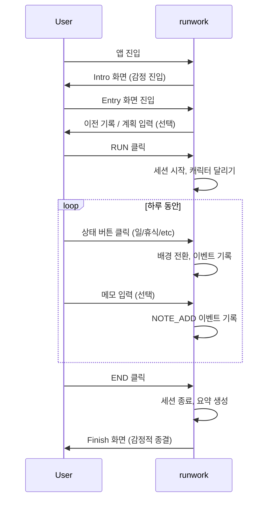

# runwork – Product Overview

## 1. 제품 개요

**제품명**: runwork

**한 줄 설명**: runwork는 시간을 관리하는 서비스가 아니라, 오늘 내가 멈추지 않고 달려왔다는 사실을 기록하는 서비스다.

**제품 유형**:
- 개인용 데일리 로그 서비스
- 실시간 인터랙션 기반 웹 애플리케이션

---

## 2. 문제 정의 (Problem Statement)

대부분의 생산성 도구는 하루를 결과로 평가한다.
- 얼마나 오래 일했는가
- 얼마나 많은 일을 끝냈는가
- 계획을 얼마나 달성했는가

이 과정에서 기록은 곧 평가가 되고, 평가는 부담이 되며, 결국 기록 자체를 포기하게 된다.

**문제는 사람들이 게을러서가 아니라, 기록 시스템이 너무 무겁기 때문이다.**

---

## 3. 제품 목적 (Product Purpose)

runwork의 목적은 하루를 관리하는 것이 아니라 **하루를 완주했다는 감각**을 제공하는 것이다.

- 완벽하지 않아도 된다
- 중간에 쉬어도 된다
- 계획과 달라도 된다

중요한 것은 단 하나다.

> **"오늘도 나는 멈추지 않았다."**

---

## 4. 제품이 아닌 것 (Non-Goals)

runwork는 다음을 **의도적으로 하지 않는다**:

| 하지 않는 것 | 이유 |
|-------------|------|
| 타임 트래킹 자동화 | 자동화는 감각을 빼앗는다 |
| 생산성 점수 산출 | 점수는 평가가 된다 |
| 주/월 단위 통계 | 비교의 대상이 된다 |
| 목표 관리 및 알림 | 압박이 된다 |
| 다른 사용자와의 비교 | 경쟁이 된다 |

이러한 기능은 v1의 철학을 훼손한다.

---

## 5. 핵심 사용자 경험 (Core Experience)

### 5.1 화면별 역할

| 화면 | 역할 | 핵심 감정 |
|------|------|----------|
| Intro | 분위기와 감정 진입 | 기대감 |
| Entry | 선택 최소화, 즉시 시작 | 가벼움 |
| Run | 실시간 기록과 몰입 | 함께 달리는 느낌 |
| Finish | 하루의 감정적 종결 | 완주한 뿌듯함 |

### 5.2 Run Screen (제품의 핵심)

Run Screen은 runwork의 **80%**다.
- 캐릭터가 화면을 가로질러 계속 달린다
- 배경은 시간과 상태에 따라 변화한다
- 하단 버튼과 문장 입력으로 상태를 전환한다
- 화면은 항상 살아 움직인다

사용자는 "기록하고 있다"기보다 **"함께 달리고 있다"**는 감각을 느껴야 한다.

### 5.3 Finish Screen

- 캐릭터가 감속 후 정지
- 하루의 트랙이 한 번에 펼쳐짐
- 숫자보다 흐름이 먼저 보임
- 메시지는 평가가 아닌 응원

---

## 6. v1 완료 기준 (Definition of Done)

runwork v1은 아래 조건을 만족하면 완료다.

| # | 조건 | 검증 방법 |
|---|------|----------|
| 1 | RUN 버튼으로 즉시 시작 가능 | 입력 없이 RUN 가능 |
| 2 | 상태 전환이 즉시 시각적으로 반영됨 | 버튼 클릭 → 배경 전환 |
| 3 | 문장 입력으로 로그를 남길 수 있음 | 메모 저장 확인 |
| 4 | 하루를 명시적으로 종료할 수 있음 | END 클릭 → Finish 화면 |
| 5 | 해당 하루를 다시 볼 수 있음 | History에서 조회 |

**이 다섯 가지 외의 기능은 완성 조건이 아니다.**

---

## 7. 성공 지표 (Success Metrics)

정량 지표보다 **정성 지표**를 우선한다.

| 질문 | 의미 |
|------|------|
| 사용자가 하루를 끝내고 앱을 바로 닫지 않는가? | Finish 화면의 가치 |
| Finish 화면을 끝까지 보는가? | 감정적 연결 |
| 다음 날 다시 RUN을 누르는가? | 지속적 사용 |

이 질문에 "그렇다"면, runwork는 성공이다.

---

## 8. 마무리

runwork는 더 잘 일하게 만들기 위한 서비스가 아니다.
**더 괜찮은 하루를 만들기 위한 서비스다.**

> 오늘도, runwork.
