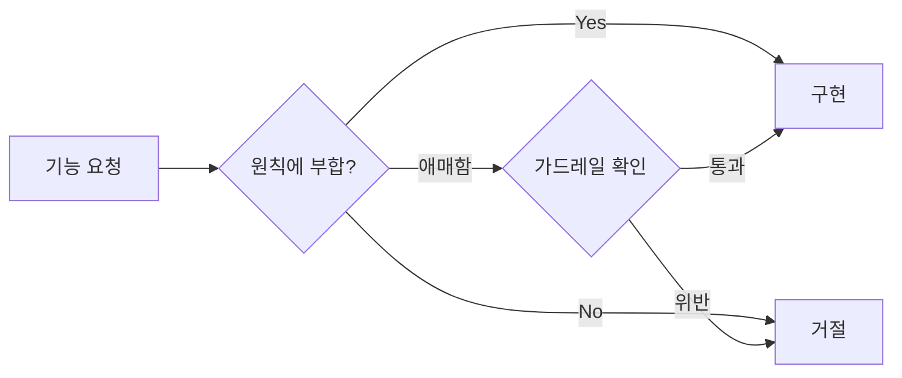
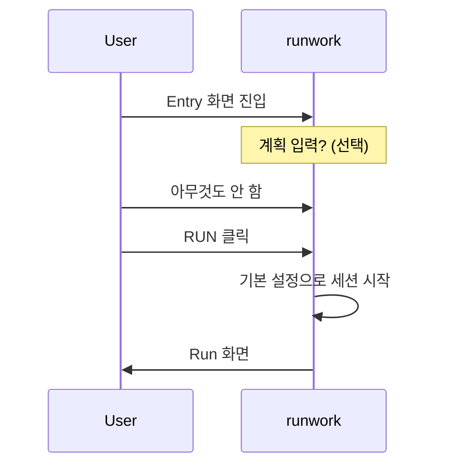
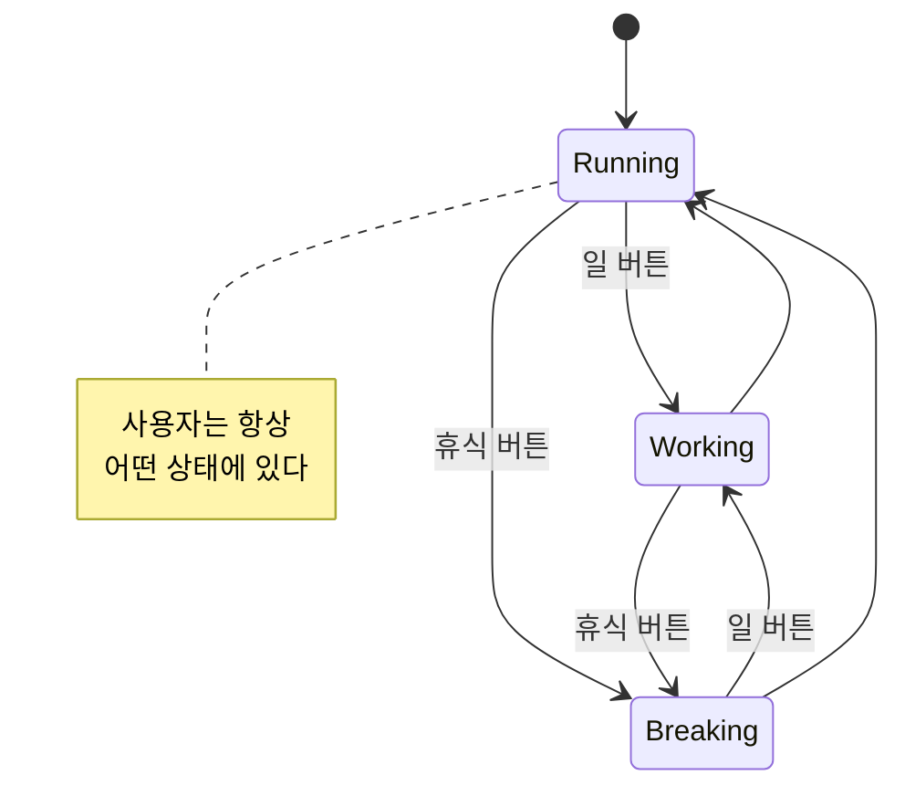
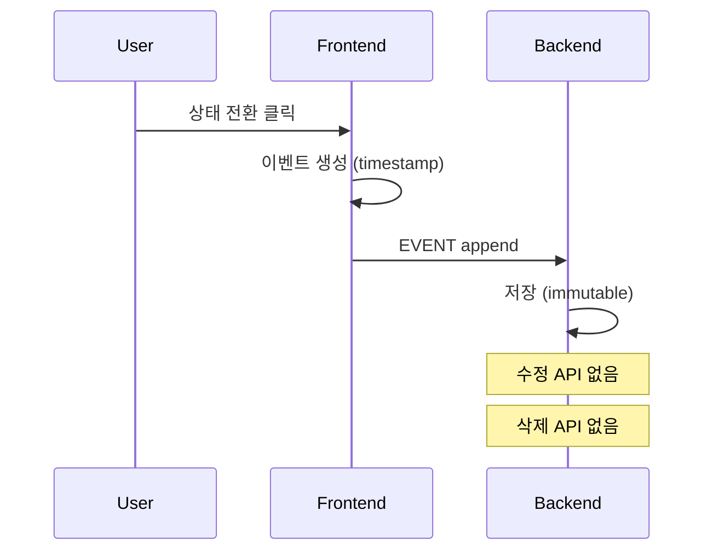
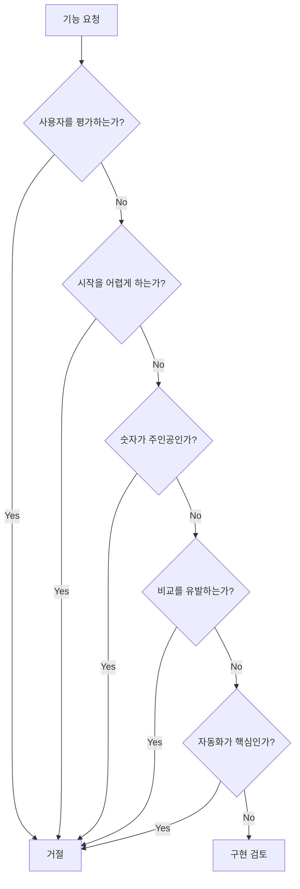

# Product Principles & Guardrails

## 1. 설계 원칙 (Design Principles)

모든 UX/기능 결정은 아래 원칙에 따라 판단한다.



---

### Principle 1: Zero Friction Start

> 어떤 준비도 없이 바로 시작할 수 있어야 한다.

| 허용 | 금지 |
|------|------|
| 입력 없이 RUN 가능 | 필수 입력 폼 |
| 선택적 계획 입력 | 목표 설정 강제 |
| 기본 설정으로 즉시 시작 | 온보딩 퀴즈 |

**적용 예시**:


---

### Principle 2: User Is Always Moving

> 멈춤도 하나의 상태다. 기록되지 않는 시간은 없다.

| 허용 | 금지 |
|------|------|
| 휴식 버튼 | 일시정지 기능 |
| 상태 전환 | 기록 중단 |
| GAP 표시 (이탈 시) | 빈 시간대 |

**적용 예시**:


---

### Principle 3: No Retrospective Editing

> 기록은 수정할 수 없다. 하루는 되돌릴 수 없다.

| 허용 | 금지 |
|------|------|
| 이벤트 append | 이벤트 수정 |
| 이탈 시간 라벨링 | 과거 기록 삭제 |
| 복귀 시 조정 (1회) | 자유로운 편집 |

**적용 예시**:


---

### Principle 4: Visual First, Numbers Later

> 숫자는 보조 정보. 흐름과 움직임이 1차 정보.

| 허용 | 금지 |
|------|------|
| 타임라인 시각화 | 원형 차트 |
| 캐릭터 애니메이션 | 생산성 점수 |
| 색상으로 상태 구분 | 퍼센티지 강조 |
| 작은 숫자 표시 | 숫자 기반 비교 |

**적용 예시**:
```
Finish 화면

✅ 좋은 예:
┌─────────────────────────────────────┐
│ ████░░░░████████░░░░████            │  ← 타임라인 바
│  일   휴식    일    휴식   일       │
│                                     │
│ 총 8시간 32분                       │  ← 숫자는 작게
└─────────────────────────────────────┘

❌ 나쁜 예:
┌─────────────────────────────────────┐
│        오늘의 생산성: 78점          │
│                                     │
│   일: 65%  휴식: 35%                │
│   목표 대비 달성률: 82%             │
└─────────────────────────────────────┘
```

---

## 2. 가드레일 (Guardrails)

### v1에서 절대 추가하지 않는 기능

| 금지 기능 | 이유 |
|----------|------|
| 통계 화면 | 비교의 대상이 됨 |
| 사용자 간 비교 | 경쟁 유발 |
| 생산성 점수 | 평가가 됨 |
| 자동 시작/종료 | 주체성 상실 |
| 목표 설정 | 압박이 됨 |
| 알림/리마인더 | 강제성 부여 |
| 주간/월간 리포트 | 분석 도구화 |

---

### 기능 요청 체크리스트

새 기능 요청 시 아래 질문에 모두 "아니오"여야 구현 가능:



---

## 3. 원칙 적용 예시

### Case 1: "주간 통계를 보여주면 좋겠어요"

**판단**:
- Principle 4 위반: 숫자가 주인공
- 가드레일 위반: 통계 화면

**결론**: 거절

---

### Case 2: "버튼 이름을 바꾸고 싶어요"

**판단**:
- Principle 1 준수: 시작에 영향 없음
- Principle 2 준수: 상태 전환에 영향 없음
- 가드레일 통과

**결론**: 허용 (커스터마이징 범위 내)

---

### Case 3: "자동으로 퇴근 시간에 END 해주세요"

**판단**:
- Principle 3 위반: 사용자 주체성 제거
- 가드레일 위반: 자동화

**결론**: 거절

---

## 4. 예외 허용 케이스

| 케이스 | 허용 이유 | 제한 조건 |
|--------|----------|----------|
| 24시간 자동 종료 | 데이터 무결성 | 사용자 알림 필수 |
| 이탈 시간 조정 | 실수 복구 | 1회만, 복귀 시점에만 |
| 연속 달리기 표시 | 동기 부여 | History 내에서만, 강조 금지 |
