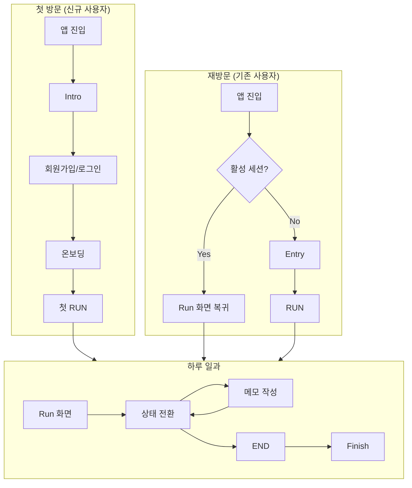
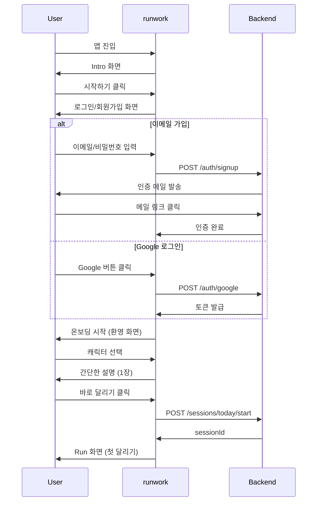
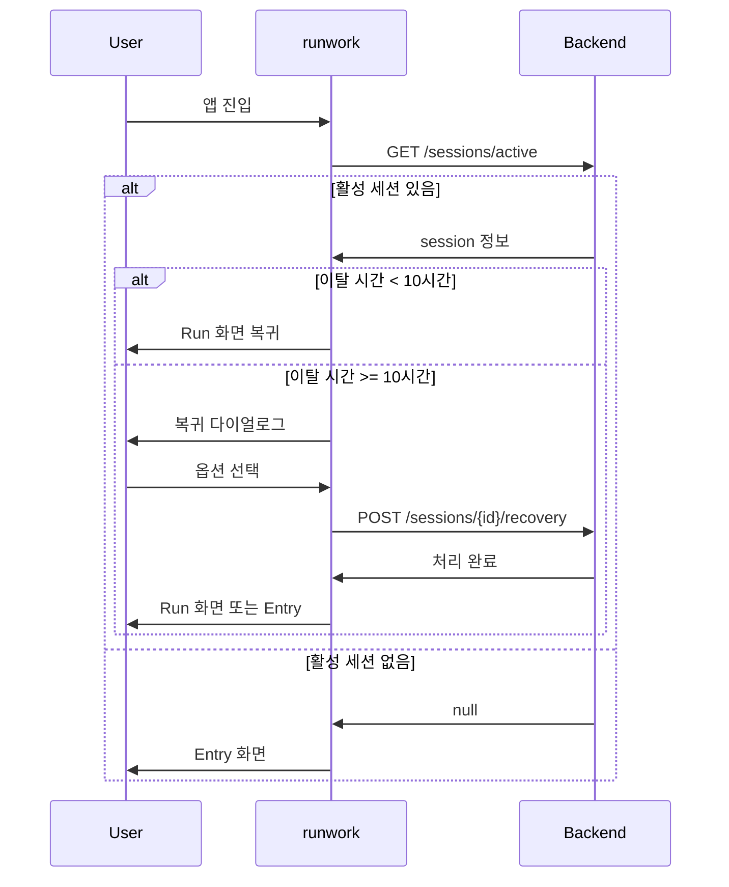
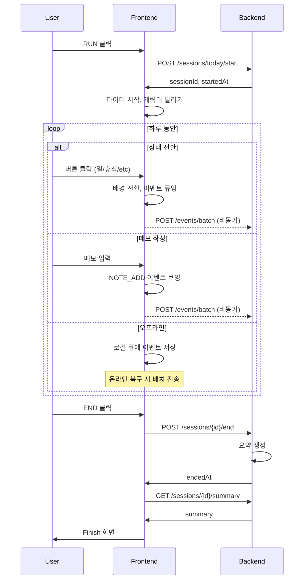
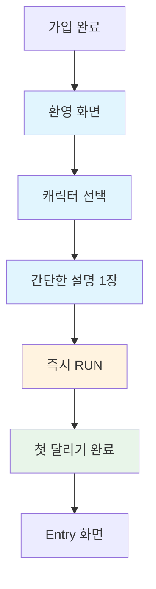
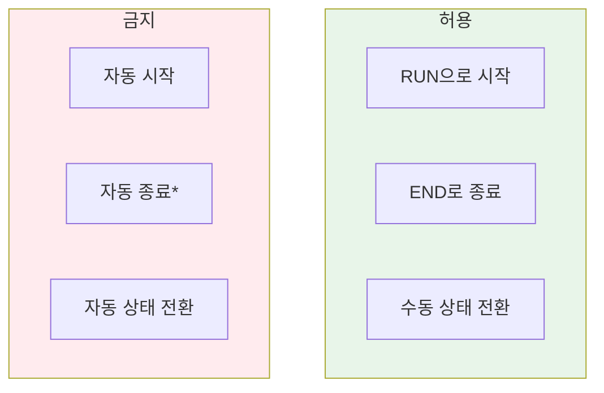
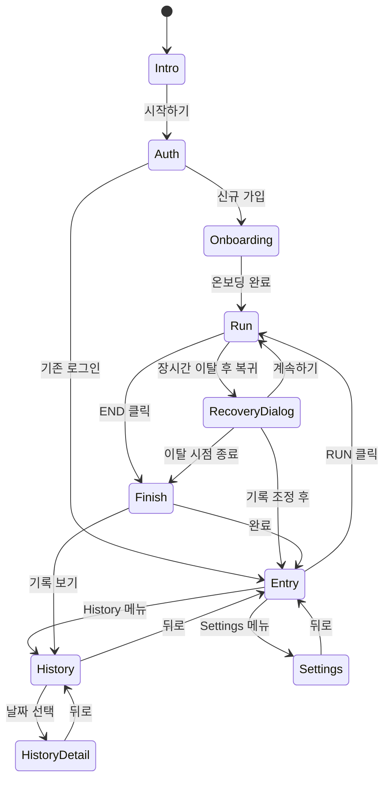

# User Experience Flow

## 1. 전체 사용자 여정



---

## 2. 화면별 상세 플로우

### 2.1 신규 사용자 플로우



### 2.2 기존 사용자 플로우



### 2.3 Run 세션 플로우



---

## 3. 온보딩 상세

### 3.1 온보딩 진입 조건
- 신규 가입 완료 직후
- `isNewUser: true` 상태

### 3.2 온보딩 플로우



### 3.3 온보딩 화면 상세

#### Step 1: 환영 화면
```
┌─────────────────────────────────────────┐
│                                         │
│          runwork에 오신 것을            │
│              환영합니다                 │
│                                         │
│     "오늘도 멈추지 않고 달려봐요"       │
│                                         │
│   ┌─────────────────────────────────┐   │
│   │           시작하기              │   │
│   └─────────────────────────────────┘   │
│                                         │
└─────────────────────────────────────────┘
```

#### Step 2: 캐릭터 선택
```
┌─────────────────────────────────────────┐
│                                         │
│        함께 달릴 친구를 골라주세요      │
│                                         │
│   [러너] [고양이] [강아지] [토끼]       │
│   [ 곰 ] [펭귄]  [여우]  [햄스터]       │
│                                         │
│        (나중에 언제든 바꿀 수 있어요)   │
│                                         │
│   ┌─────────────────────────────────┐   │
│   │             선택 완료           │   │
│   └─────────────────────────────────┘   │
│                                         │
└─────────────────────────────────────────┘
```

#### Step 3: 간단한 설명
```
┌─────────────────────────────────────────┐
│                                         │
│         버튼을 눌러 상태를 바꾸고       │
│         하루가 끝나면 END를 눌러요      │
│                                         │
│              그게 전부예요!             │
│                                         │
│   ┌─────────────────────────────────┐   │
│   │          바로 달리기!           │   │
│   └─────────────────────────────────┘   │
│                                         │
└─────────────────────────────────────────┘
```

### 3.4 온보딩 규칙

| 규칙 | 설명 |
|------|------|
| 스킵 불가 | 전체 과정이 30초 이내로 설계 |
| 설명 1장 | 텍스트 3줄 이하 |
| 캐릭터 필수 선택 | 기본값: runner_default |
| 첫 RUN 즉시 | 온보딩 완료 후 바로 Run 진입 |

### 3.5 온보딩 가드레일

- 모든 기능 설명 금지
- 통계/분석 언급 금지
- 목표 설정 유도 금지
- "생산성", "효율" 단어 사용 금지

---

## 4. 플로우 가드레일



**예외**: 24시간 자동 종료는 데이터 무결성을 위해 허용

---

## 5. 화면 전환 맵



---

## 6. API 연동 포인트

| 화면 전환 | API 호출 |
|----------|----------|
| 앱 진입 | `GET /sessions/active` |
| 회원가입 | `POST /auth/signup` |
| 로그인 | `POST /auth/login`, `POST /auth/google` |
| 온보딩 완료 | `POST /me/onboarding/complete` |
| RUN 시작 | `POST /sessions/today/start` |
| 상태 전환 | `POST /sessions/{id}/events/batch` |
| END | `POST /sessions/{id}/end` |
| Finish | `GET /sessions/{id}/summary` |
| 복귀 조정 | `POST /sessions/{id}/recovery` |
| History | `GET /sessions/history` |
