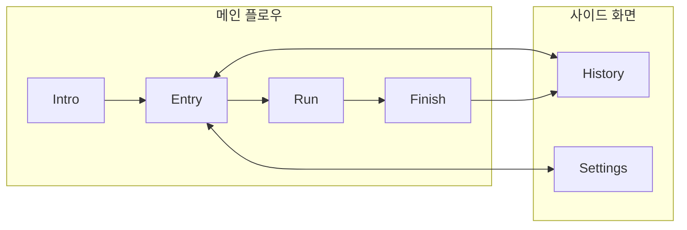
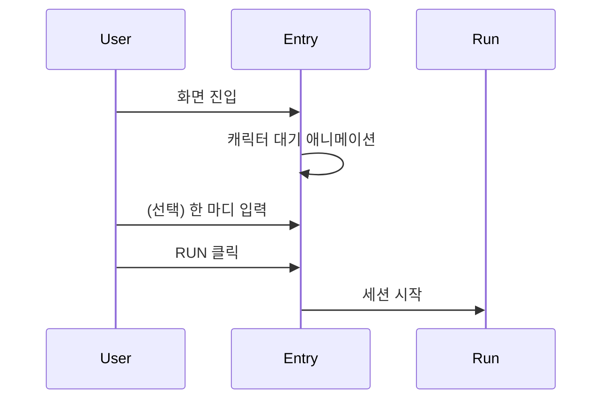
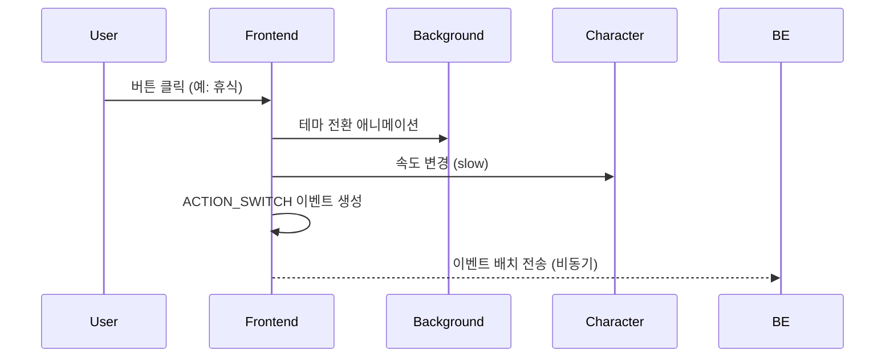
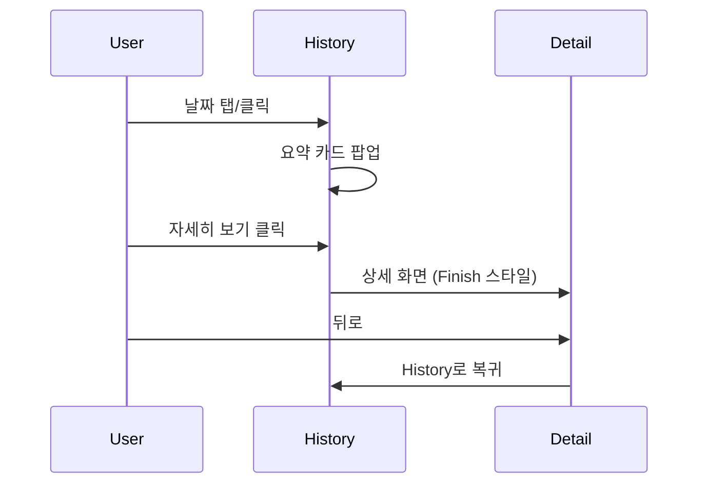
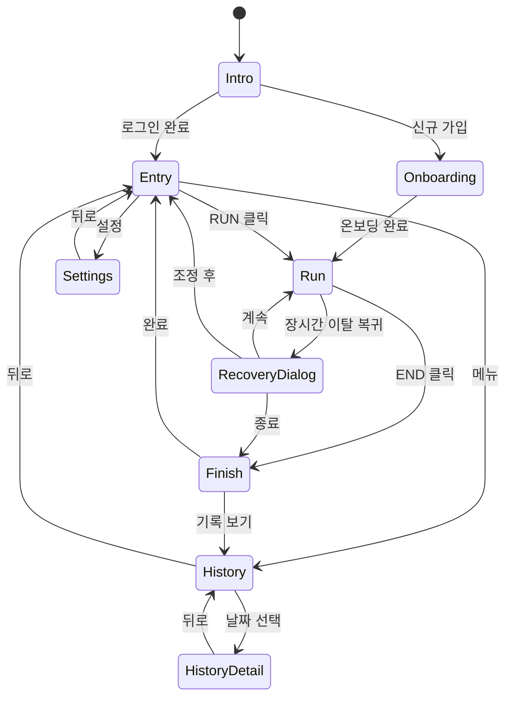

# Screen Specification

## 1. 화면 개요



---

## 2. 화면별 상세

### 2.1 Intro Screen

**목적**: 감정적 진입, 제품 분위기 전달

```
┌─────────────────────────────────────────┐
│                                         │
│                                         │
│             🏃 runwork                  │
│                                         │
│      "오늘도 멈추지 않고 달려봐요"      │
│                                         │
│                                         │
│   ┌─────────────────────────────────┐   │
│   │           시작하기              │   │
│   └─────────────────────────────────┘   │
│                                         │
│          Google로 계속하기              │
│                                         │
└─────────────────────────────────────────┘
```

| 요소 | 설명 |
|------|------|
| 로고 | 픽셀 아트 스타일 러너 아이콘 |
| 메시지 | 따뜻한 톤의 한 줄 문구 |
| CTA | 시작하기 버튼 |
| OAuth | Google 로그인 버튼 |

---

### 2.2 Entry Screen

**목적**: 선택 최소화, 즉시 시작

```
┌─────────────────────────────────────────┐
│  ☰                              ⚙️      │
├─────────────────────────────────────────┤
│                                         │
│                                         │
│     ┌───────────────────────────┐       │
│     │                           │       │
│     │      🏃 (캐릭터 대기)      │       │
│     │                           │       │
│     └───────────────────────────┘       │
│                                         │
│                                         │
│     오늘은 어떤 하루가 될까요?          │
│                                         │
│     ┌─────────────────────────────┐     │
│     │ 오늘의 한 마디 (선택)       │     │
│     └─────────────────────────────┘     │
│                                         │
│                                         │
│   ┌─────────────────────────────────┐   │
│   │             RUN                 │   │
│   └─────────────────────────────────┘   │
│                                         │
└─────────────────────────────────────────┘
```

| 요소 | 필수 | 설명 |
|------|------|------|
| 메뉴 (☰) | O | History, 로그아웃 |
| 설정 (⚙️) | O | Settings 화면 이동 |
| 캐릭터 | O | 선택한 캐릭터 대기 애니메이션 |
| 한 마디 입력 | X | 오늘의 계획/다짐 (선택) |
| RUN 버튼 | O | 세션 시작 |

**플로우**:


---

### 2.3 Run Screen (핵심)

**목적**: 실시간 몰입과 기록. runwork의 80%.

```
┌─────────────────────────────────────────┐
│                              02:34:15   │
├─────────────────────────────────────────┤
│                                         │
│   ═══════════════════════════════════   │ ← 배경 (테마별)
│        🏃💨                             │ ← 캐릭터 달리기
│   ═══════════════════════════════════   │ ← 지면
│                                         │
│                                         │
├─────────────────────────────────────────┤
│                                         │
│     ┌─────────────────────────────┐     │
│     │ 메모 입력...                │  📝 │
│     └─────────────────────────────┘     │
│                                         │
│   ┌──────┐ ┌──────┐ ┌──────┐ ┌──────┐  │
│   │  일  │ │ 휴식 │ │ 집중 │ │ 기타 │  │ ← 상태 버튼
│   └──────┘ └──────┘ └──────┘ └──────┘  │
│                                         │
│   ┌─────────────────────────────────┐   │
│   │              END                │   │
│   └─────────────────────────────────┘   │
│                                         │
└─────────────────────────────────────────┘
```

| 요소 | 설명 |
|------|------|
| 타이머 | 세션 경과 시간 (우상단, 작게) |
| 배경 | 현재 상태의 테마 배경 (패럴랙스) |
| 캐릭터 | 달리기 애니메이션 (상태별 속도) |
| 메모 입력 | 짧은 메모 작성 (NOTE_ADD) |
| 상태 버튼 | 사용자 정의 버튼 (최대 5개) |
| END 버튼 | 세션 종료 |

**상태 전환 플로우**:


**Run Screen 가드레일**:
- 설정 변경 불가
- 분석 UI 없음
- 타이머는 작게 (숫자가 주인공 아님)

---

### 2.4 Finish Screen

**목적**: 하루의 감정적 종결

```
┌─────────────────────────────────────────┐
│                                         │
│             🏃 (정지 포즈)              │
│                                         │
│        "오늘도 끝까지 달렸어요!"        │
│                                         │
├─────────────────────────────────────────┤
│                                         │
│   ┌─────────────────────────────────┐   │
│   │ ████░░░░████████░░░░░████████  │   │ ← 타임라인
│   │  일   휴식    일    휴식   일   │   │
│   │ 9:00      12:00     15:00  18:00│   │
│   └─────────────────────────────────┘   │
│                                         │
│   총 8시간 32분                         │
│                                         │
│   ┌─────────────────────────────────┐   │
│   │ 📝 10:30 "집중 잘 됨"           │   │
│   │ 📝 15:00 "오후 슬럼프..."       │   │
│   └─────────────────────────────────┘   │
│                                         │
│   ┌─────────────────────────────────┐   │
│   │           완료                  │   │
│   └─────────────────────────────────┘   │
│                                         │
└─────────────────────────────────────────┘
```

| 요소 | 설명 |
|------|------|
| 캐릭터 | 감속 후 정지 애니메이션 |
| 메시지 | 격려 메시지 (평가 아님) |
| 타임라인 | 하루 흐름 시각화 |
| 노트 목록 | 작성한 메모들 |
| 총 시간 | 작게 표시 |

**Finish Screen 가드레일**:
- 분석 UI 금지
- 점수/등급 금지
- 비교 금지

---

### 2.5 History Screen

**목적**: 과거 기록 회상 (분석 아님)

```
┌─────────────────────────────────────────┐
│  ←  History                             │
├─────────────────────────────────────────┤
│                                         │
│  ←  2025년 12월                    →    │
│                                         │
│   일   월   화   수   목   금   토      │
│                                         │
│        1    2    3    4    5    6       │
│             ●         ●    ●            │
│                                         │
│   7    8    9   10   11   12   13       │
│   ●              ●    ●    ●    ◐       │
│                                         │
│  14   15   16   17   18   19   20       │
│                                         │
│  21   22   23   24   25   26   27       │
│                                         │
│  28   29   30   31                      │
│                                         │
├─────────────────────────────────────────┤
│                                         │
│   이번 달: 12일 달림                    │
│   연속 최고: 5일                        │
│                                         │
└─────────────────────────────────────────┘

● = 완주한 날 (픽셀 캐릭터 마커)
◐ = 오늘 (진행 중/시작 전)
```

**비주얼 스타일**:
- **픽셀 아트 기반** 달력
- 완주한 날: 작은 픽셀 캐릭터가 앉아있음
- 연속 달리기: 픽셀 선으로 연결
- 빈 날: 작은 풀/꽃 픽셀 장식
- 월 헤더: 계절별 픽셀 아트 장식

**날짜 선택 플로우**:


**History 가드레일**:
- 분석/비교 UI 금지
- 점수/등급 표시 금지
- 목표 대비 달성률 금지

---

### 2.6 Settings Screen

**목적**: 안정적인 몰입을 위한 사전 설정

```
┌─────────────────────────────────────────┐
│  ←  Settings                            │
├─────────────────────────────────────────┤
│                                         │
│  캐릭터                                 │
│  ┌─────┐ ┌─────┐ ┌─────┐ ┌─────┐       │
│  │ 🏃 ✓│ │ 🐱  │ │ 🐶  │ │ ... │       │
│  └─────┘ └─────┘ └─────┘ └─────┘       │
│                                         │
│  버튼 설정                              │
│  ┌─────────────────────────────────┐   │
│  │ 1. [일]      테마: 도시의 낮    │   │
│  │ 2. [휴식]    테마: 공원의 아침  │   │
│  │ 3. [집중]    테마: 도시의 밤    │   │
│  │ + 버튼 추가                     │   │
│  └─────────────────────────────────┘   │
│                                         │
│  ─────────────────────────────────────  │
│                                         │
│  Live Preview                           │
│  ┌─────────────────────────────────┐   │
│  │      🏃💨  (미리보기)           │   │
│  │  ═══════════════════════════    │   │
│  └─────────────────────────────────┘   │
│                                         │
└─────────────────────────────────────────┘
```

| 설정 항목 | 범위 |
|----------|------|
| 캐릭터 | 제공된 목록에서 선택 |
| 버튼 이름 | 최대 10자 |
| 버튼 개수 | 1~5개 |
| 버튼별 테마 | 제공된 5개 테마 |

**Live Preview 규칙**:
- Preview와 실제 Run 화면은 **동일**해야 함
- 설정 변경 시 즉시 Preview 반영

---

## 3. 화면 전환 규칙



---

## 4. 공통 가드레일

| 화면 | 금지 사항 |
|------|----------|
| Run | 설정 변경, 분석 UI, 타이머 강조 |
| Finish | 분석 UI, 점수, 비교 |
| History | 분석 UI, 점수, 비교, 달성률 |
| Settings | Run 중 접근 |
