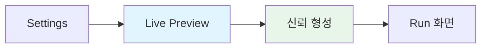
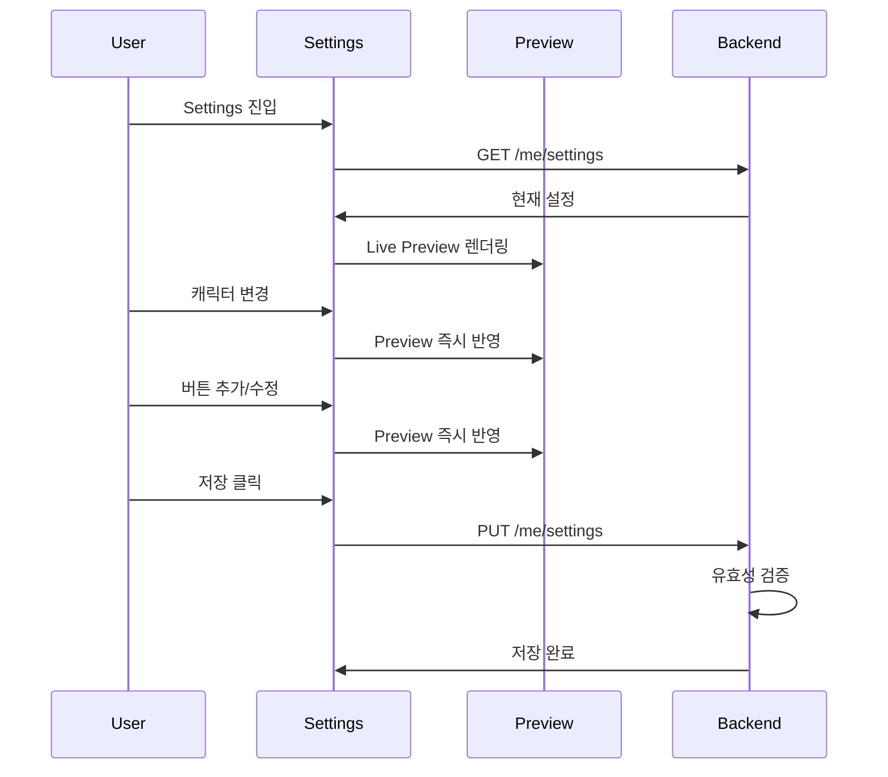
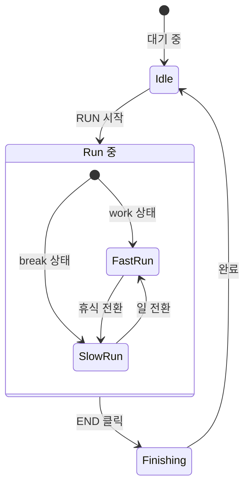

# Customization & Asset Catalog

## 1. 커스터마이징 철학

커스터마이징은 **자유도**가 아니라 **안정적인 몰입**을 위한 사전 설정이다.



---

## 2. 커스터마이징 범위

### 2.1 허용된 설정

| 항목 | 범위 | 설명 |
|------|------|------|
| 캐릭터 | 제공된 목록 | 11종 (러너 3 + 동물 8) |
| 버튼 이름 | 최대 10자 | 한글/영문/이모지 |
| 버튼 개수 | 1~5개 | 최소 1개 필수 |
| 버튼별 테마 | 제공된 5개 | 상태별 배경 지정 |
| 버튼 종류 | work/break/neutral | 캐릭터 속도에 영향 |

### 2.2 금지된 설정

| 항목 | 이유 |
|------|------|
| 버튼 위치 변경 | UI 일관성 유지 |
| 사용자 에셋 업로드 | 품질 통제 불가 |
| 무제한 상태 생성 | 복잡도 증가 |
| 색상 커스터마이징 | 브랜드 일관성 |

---

## 3. Settings 화면 플로우



### Live Preview 규칙

- Preview와 실제 Run 화면은 **100% 동일**해야 함
- 설정 변경 시 즉시 Preview 반영 (저장 전에도)
- Preview에서 확인한 것이 Run에서 그대로 나와야 **신뢰** 형성

---

## 4. 테마 카탈로그 (v1: 5개)

### 4.1 city_day (도시의 낮)

| 속성 | 값 |
|------|-----|
| **분위기** | 활기찬, 생산적인 |
| **배경** | 밝은 하늘, 픽셀 빌딩 스카이라인 |
| **추천** | work 상태 |
| **팔레트** | #87CEEB, #FFE4B5, #808080 |

### 4.2 city_night (도시의 밤)

| 속성 | 값 |
|------|-----|
| **분위기** | 차분한, 집중하는 |
| **배경** | 어두운 하늘, 네온사인, 별 |
| **추천** | work 상태 (야간) |
| **팔레트** | #191970, #FFD700, #FF69B4 |

### 4.3 park_morning (공원의 아침)

| 속성 | 값 |
|------|-----|
| **분위기** | 상쾌한, 시작하는 |
| **배경** | 초록 잔디, 나무, 떠오르는 해 |
| **추천** | neutral 상태, 세션 시작 |
| **팔레트** | #90EE90, #FFA07A, #87CEEB |

### 4.4 beach_sunset (해변의 노을)

| 속성 | 값 |
|------|-----|
| **분위기** | 여유로운, 쉬어가는 |
| **배경** | 모래사장, 파도, 주황빛 하늘 |
| **추천** | break 상태 |
| **팔레트** | #FF7F50, #FFD700, #4169E1 |

### 4.5 mountain_twilight (산의 황혼)

| 속성 | 값 |
|------|-----|
| **분위기** | 고요한, 마무리하는 |
| **배경** | 산 실루엣, 보라빛 하늘, 초승달 |
| **추천** | break 상태, 세션 종료 |
| **팔레트** | #9370DB, #2F4F4F, #F0E68C |

### 테마 데이터 구조

```json
{
  "themeId": "city_day",
  "name": "도시의 낮",
  "description": "활기찬 도시를 달리세요",
  "layers": [
    { "type": "sky", "parallaxSpeed": 0.1 },
    { "type": "background", "parallaxSpeed": 0.3 },
    { "type": "midground", "parallaxSpeed": 0.6 },
    { "type": "ground", "parallaxSpeed": 1.0 }
  ],
  "ambientColor": "#87CEEB",
  "groundColor": "#808080"
}
```

---

## 5. 캐릭터 카탈로그 (v1: 11종)

### 5.1 러너 캐릭터 (3종)

| ID | 이름 | 설명 | 특징 |
|----|------|------|------|
| runner_default | 기본 러너 | 심플한 픽셀 사람 | 기본 캐릭터 |
| runner_hoodie | 후드티 러너 | 캐주얼한 느낌 | 편안한 분위기 |
| runner_suit | 정장 러너 | 정장 입고 달리기 | 유머러스 |

### 5.2 동물 캐릭터 (8종)

| ID | 이름 | 설명 | 특수 애니메이션 |
|----|------|------|----------------|
| animal_cat | 고양이 | 귀여운 픽셀 고양이 | 꼬리 흔들림, meow |
| animal_dog | 강아지 | 활발한 픽셀 강아지 | 귀 펄럭임, bark |
| animal_rabbit | 토끼 | 깡총깡총 뛰는 토끼 | hop 모션 |
| animal_bear | 곰 | 느긋한 픽셀 곰 | yawn |
| animal_penguin | 펭귄 | 뒤뚱뒤뚱 펭귄 | waddle, slide |
| animal_fox | 여우 | 날렵한 픽셀 여우 | 빠른 모션 |
| animal_hamster | 햄스터 | 작고 귀여운 햄스터 | eat |

### 캐릭터 데이터 구조

```json
{
  "characterId": "animal_cat",
  "name": "달리는 고양이",
  "type": "animal",
  "spriteSheet": {
    "src": "/assets/characters/cat.png",
    "frameWidth": 32,
    "frameHeight": 32
  },
  "animations": {
    "run": { "frames": [0,1,2,3,4,5], "fps": 12, "loop": true },
    "idle": { "frames": [6,7], "fps": 2, "loop": true },
    "finish": { "frames": [8,9,10,11], "fps": 8, "loop": false }
  },
  "offsetY": 0
}
```

### 애니메이션 상태 매핑



| 세션 상태 | 애니메이션 | 속도 |
|----------|-----------|------|
| IDLE | idle | - |
| RUNNING + work | run | fast |
| RUNNING + break | run / idle | slow |
| FINISHING | finish | 감속 |
| FINISHED | idle | - |

---

## 6. 에셋 가이드라인

### 픽셀 아트 규격

| 요소 | 크기 | 렌더링 |
|------|------|--------|
| 캐릭터 | 32x32px | 2x 확대 |
| 배경 타일 | 16x16px | 1x |
| 색상 | 팔레트당 최대 16색 | - |

### 분위기 기준

- 따뜻하고 친근한 느낌
- 과도한 디테일 지양
- 부드러운 색상 사용
- 위협적이거나 어두운 요소 **금지**

---

## 7. API

### GET /assets/themes

```json
{
  "themes": [
    {
      "themeId": "city_day",
      "name": "도시의 낮",
      "description": "활기찬 도시를 달리세요",
      "previewUrl": "/assets/themes/city_day/preview.png"
    }
  ]
}
```

### GET /assets/characters

```json
{
  "characters": [
    {
      "characterId": "animal_cat",
      "name": "달리는 고양이",
      "type": "animal",
      "previewUrl": "/assets/characters/cat/preview.gif"
    }
  ]
}
```

### PUT /me/settings

```json
{
  "version": 3,
  "characterId": "animal_cat",
  "actions": [
    {
      "slot": 0,
      "label": "일",
      "kind": "work",
      "themeId": "city_day",
      "pace": "fast"
    },
    {
      "slot": 1,
      "label": "휴식",
      "kind": "break",
      "themeId": "beach_sunset",
      "pace": "slow"
    }
  ]
}
```

**유효성 검증**:
- `actions.length` ≤ 5
- `slot`: 0~4, 중복 불가
- `label`: 최대 10자
- `themeId`, `characterId`: 제공 목록 내 값만

---

## 8. 확장 계획 (v2+)

| 버전 | 추가 내용 |
|------|----------|
| v2 | 계절 테마 (봄/여름/가을/겨울) |
| v2 | 시간대별 자동 테마 전환 |
| v2 | 추가 동물 (오리, 코알라, 판다) |
| v3 | 캐릭터 악세서리 (모자, 안경) |
| v3+ | 사용자 업로드 캐릭터 (검수 필요) |
