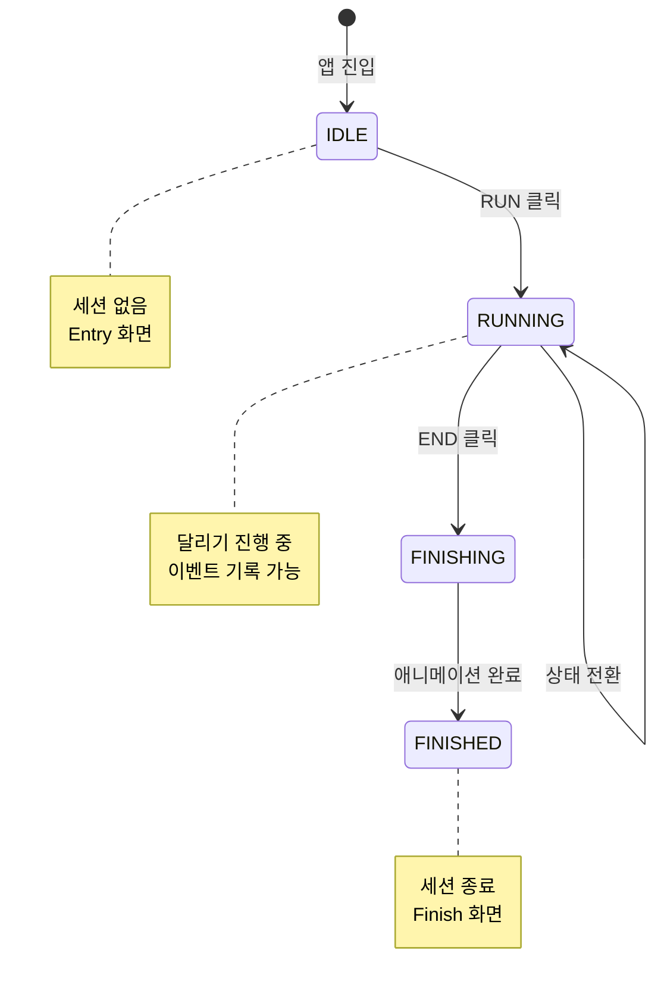
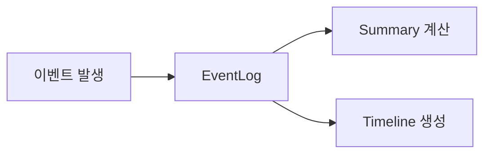
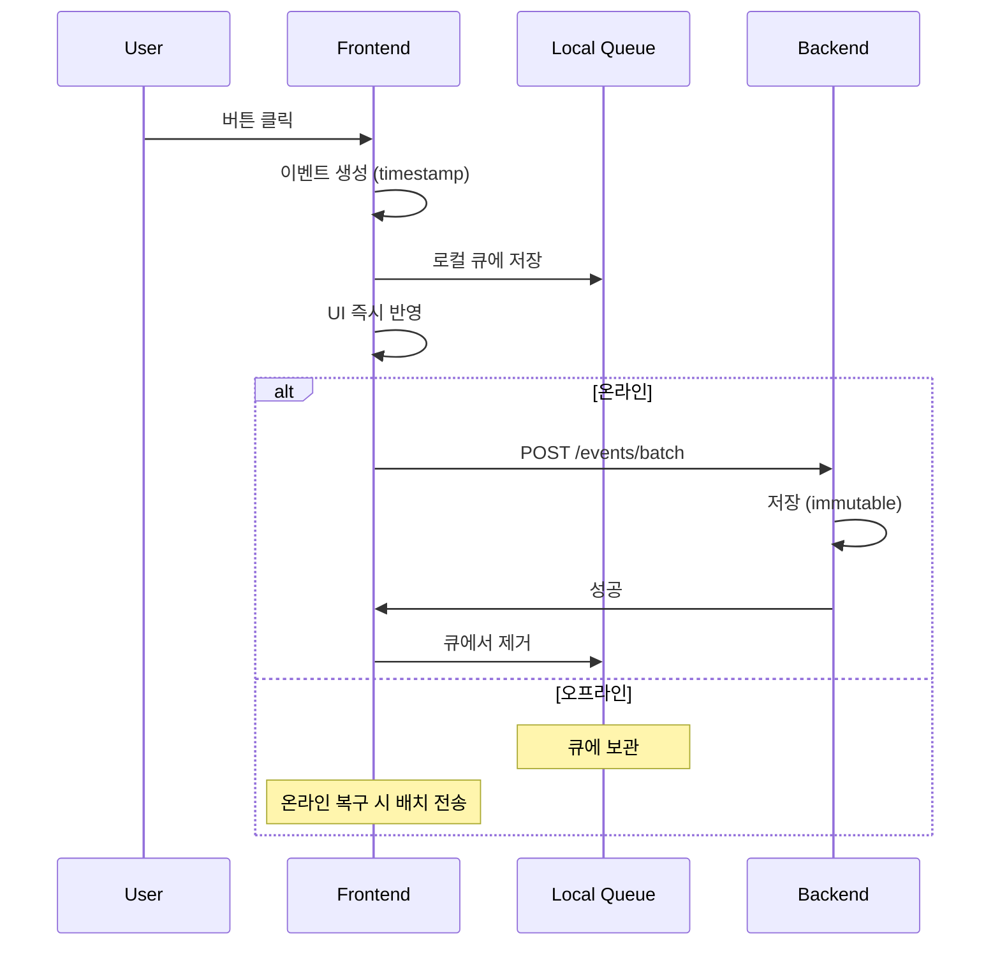
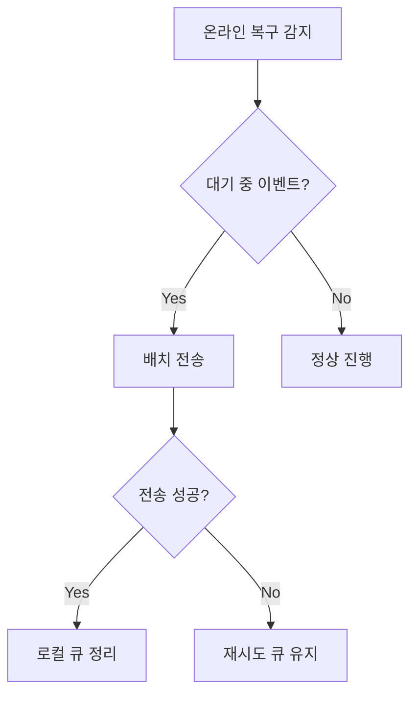
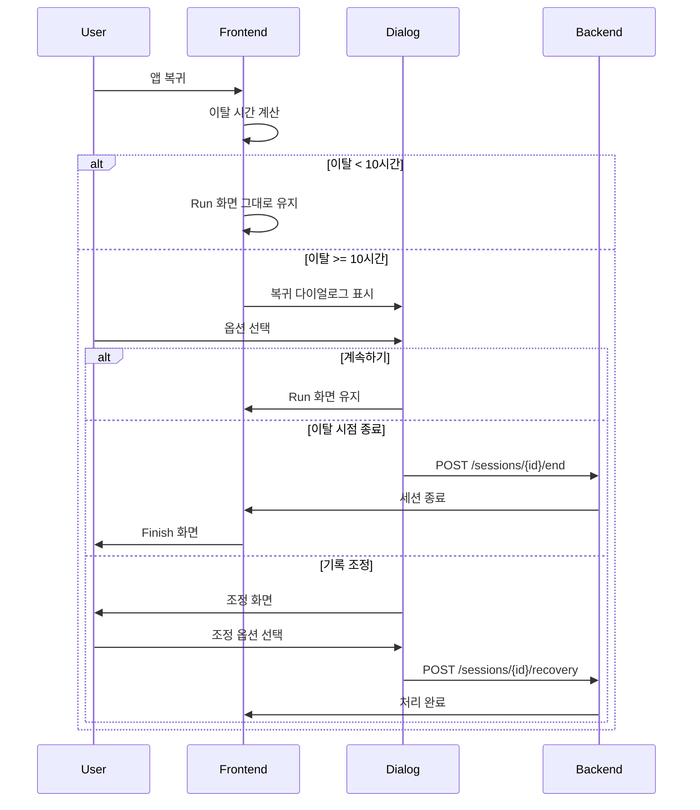
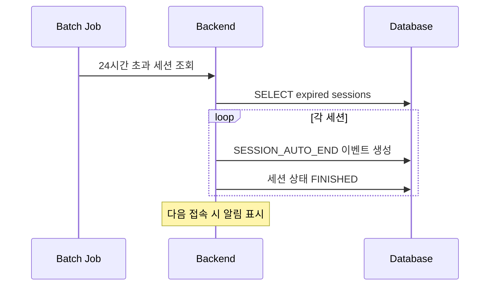

# Session & State Management

## 1. 세션 라이프사이클

### 1.1 세션 상태



| 상태 | 설명 | 허용 동작 |
|------|------|----------|
| IDLE | 세션 없음, Entry 화면 | RUN만 가능 |
| RUNNING | 달리기 진행 중 | 상태 전환, 메모, END |
| FINISHING | END 후 애니메이션 중 | 없음 (대기) |
| FINISHED | 세션 종료 완료 | Finish 화면 조회 |

### 1.2 세션 규칙

- 하루에 세션은 **하나만** 존재 가능
- 세션은 **명시적으로** 시작되고 종료되어야 함
- FINISHED 이후 이벤트 수신 불가
- 자정 자동 시작/종료 없음 (24시간 자동 종료는 예외)

---

## 2. Run 상태 머신

### 2.1 상태 구조

Run 중에는 **세션 상태**와 **현재 Action**이 병렬로 관리됨:

```mermaid
stateDiagram-v2
    state "Run Session" as RS {
        state "Session State" as SS {
            RUNNING
        }

        state "Current Action" as CA {
            Work
            Break
            Neutral
            --
            Work --> Break: 휴식 버튼
            Break --> Work: 일 버튼
            Work --> Neutral: 기타 버튼
            Neutral --> Work: 일 버튼
        }
    }
```

### 2.2 Current Action 구조

```json
{
  "slot": 0,
  "label": "일",
  "kind": "work",
  "themeId": "city_day",
  "pace": "fast"
}
```

| 필드 | 설명 |
|------|------|
| slot | 버튼 슬롯 (0~4) |
| label | 표시 이름 |
| kind | work / break / neutral |
| themeId | 배경 테마 |
| pace | 캐릭터 속도 (fast/slow) |

### 2.3 전환 규칙

- Action 변경은 **RUNNING** 상태에서만 가능
- END는 **RUNNING** 상태에서만 가능
- 전환 시 즉시 시각적 피드백 (배경, 캐릭터 속도)

---

## 3. 이벤트 시스템

### 3.1 이벤트 철학

> **Event는 사실이다. 해석은 나중에 한다.**

- 이벤트는 **append-only** (수정/삭제 없음)
- 모든 상태 변화는 이벤트로 기록
- 요약/분석은 이벤트로부터 계산



### 3.2 이벤트 타입

| 타입 | 발생 시점 | 설명 |
|------|----------|------|
| SESSION_START | RUN 클릭 | 세션 시작 |
| ACTION_SWITCH | 버튼 클릭 | 상태 전환 |
| NOTE_ADD | 메모 입력 | 노트 추가 |
| SESSION_END | END 클릭 | 수동 종료 |
| SESSION_AUTO_END | 24시간 초과 | 자동 종료 |
| GAP_MARKED | 복귀 시 조정 | 기록 제외 구간 |
| RECOVERY_ADJUSTMENT | 복귀 시 조정 | 이탈 시간 처리 |

### 3.3 이벤트 구조

```json
{
  "eventId": "evt_001",
  "sessionId": "sess_123",
  "ts": "2025-12-13T10:30:00Z",
  "type": "ACTION_SWITCH",
  "payload": {
    "actionSlot": 1,
    "label": "휴식"
  }
}
```

### 3.4 이벤트 플로우



---

## 4. 오프라인 처리

### 4.1 기본 원칙

- Run 중 네트워크 끊김 → **백그라운드에서 계속 동작**
- 이벤트는 로컬(IndexedDB)에 큐잉
- 온라인 복구 시 서버로 배치 전송

### 4.2 로컬 큐 구조

```json
{
  "sessionId": "sess_123",
  "pendingEvents": [
    {
      "localId": "evt_local_001",
      "ts": "2025-12-13T10:30:00Z",
      "type": "ACTION_SWITCH",
      "payload": { "actionSlot": 1 },
      "synced": false
    }
  ],
  "lastSyncAt": "2025-12-13T10:00:00Z"
}
```

### 4.3 온라인 복구 플로우



---

## 5. 장시간 이탈 처리

### 5.1 이탈 감지 조건

- 브라우저 탭 비활성화 (`visibility: hidden`)
- 브라우저/앱 백그라운드 전환
- 네트워크 끊김 상태로 **10시간 이상** 경과

### 5.2 복귀 시 플로우



### 5.3 복귀 다이얼로그

```
┌─────────────────────────────────────────┐
│                                         │
│   마지막 활동: 10시간 23분 전           │
│                                         │
│   어떻게 할까요?                        │
│                                         │
│   [📝 기록 조정하기]                    │
│   [⏹️ 이탈 시점에 자동 종료]            │
│   [▶️ 이어서 계속 달리기]               │
│                                         │
└─────────────────────────────────────────┘
```

| 옵션 | 동작 |
|------|------|
| 기록 조정하기 | 이탈 시간을 휴식/작업/제외로 기록 |
| 이탈 시점 종료 | 마지막 활동 시점으로 SESSION_END |
| 이어서 계속 | 이탈 시간도 포함하여 계속 |

### 5.4 기록 조정 옵션

| 옵션 | 결과 |
|------|------|
| 휴식으로 기록 | 이탈 시간 전체를 break로 기록 |
| 작업으로 기록 | 이탈 시간 전체를 work로 기록 |
| 기록에서 제외 | GAP_MARKED 이벤트, 총 시간에서 차감 |

---

## 6. 24시간 자동 종료

### 6.1 규칙

- 세션 시작 후 **24시간** 경과 시 자동 종료
- **서버에서** 배치 작업으로 실행 (매 시간)
- 종료 시점: 마지막 이벤트 시각 또는 24시간 시점 중 이른 것

### 6.2 자동 종료 플로우



### 6.3 자동 종료 이벤트

```json
{
  "type": "SESSION_AUTO_END",
  "ts": "2025-12-14T09:01:00Z",
  "payload": {
    "reason": "24h_timeout",
    "lastActivityAt": "2025-12-13T23:45:00Z"
  }
}
```

### 6.4 사용자 설정 (선택)

| 설정 | 기본값 | 범위 |
|------|--------|------|
| 장시간 이탈 기준 | 10시간 | 1~24시간 |
| 자동 종료 | ON | ON/OFF |

자동 종료 OFF 시:
- 24시간 제한 해제
- 수동 종료만 가능
- 단, **7일 후 강제 종료** (데이터 무결성)

---

## 7. Frontend/Backend 책임 분리

### Frontend

- 타이머 및 시간 흐름 관리
- Run 상태 머신 관리
- `visibilitychange` 이벤트로 이탈 감지
- IndexedDB에 이벤트 큐잉
- 복귀 시 다이얼로그 표시
- 온라인 복구 시 배치 동기화

### Backend

- 세션 생성/종료
- 이벤트 append-only 저장
- 24시간 초과 세션 배치 종료
- 중복 이벤트 필터링 (idempotency key)
- 요약 데이터 생성
