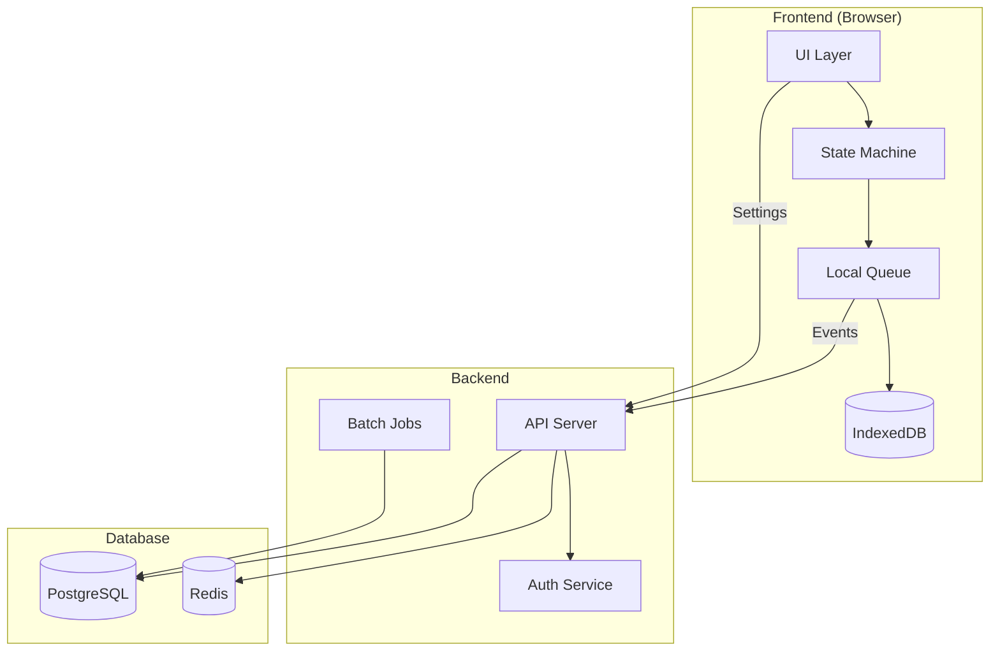
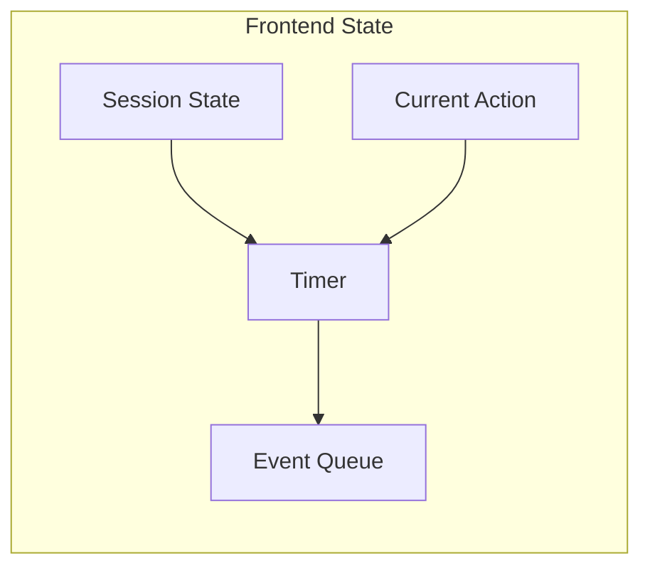
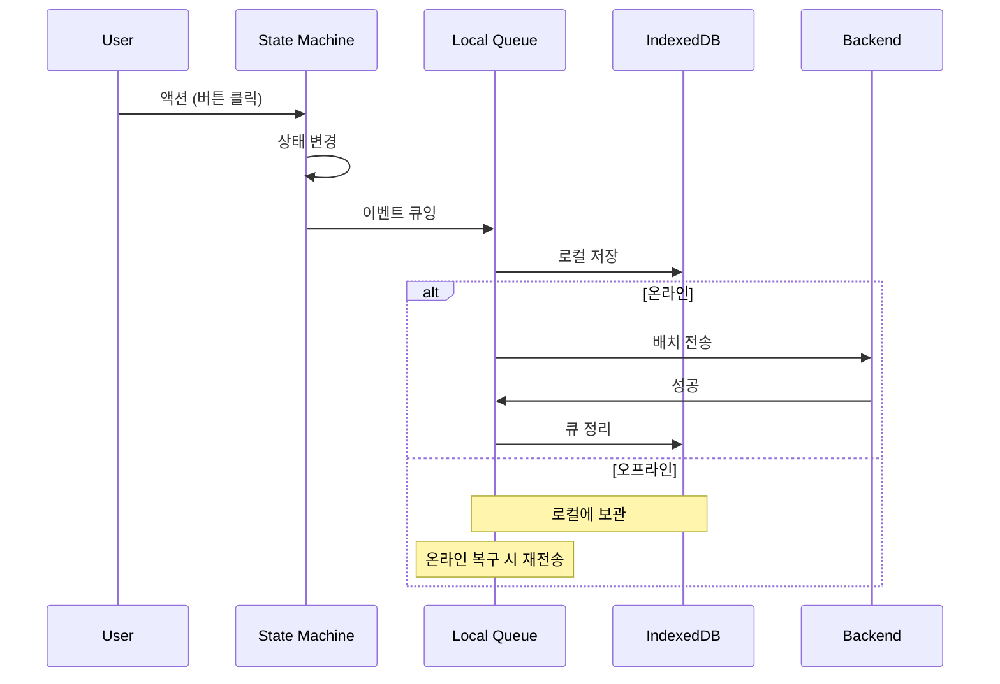
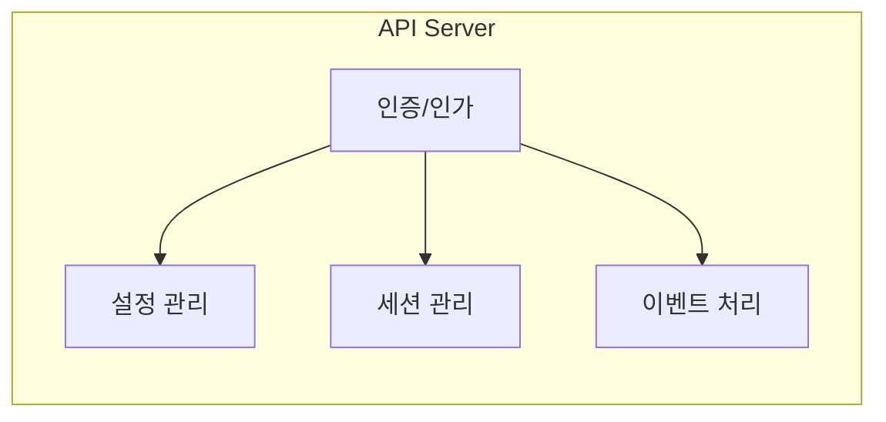
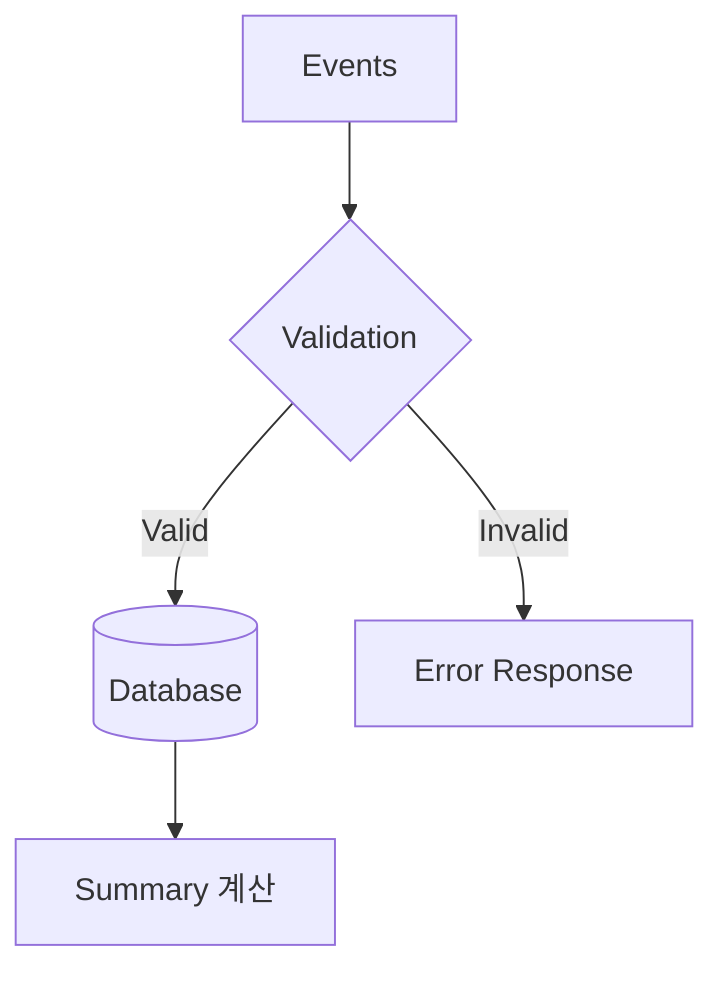
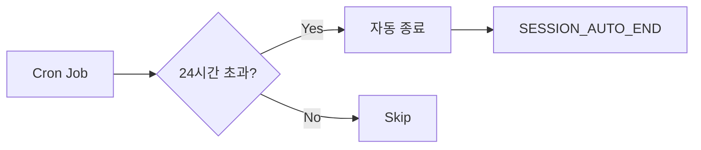
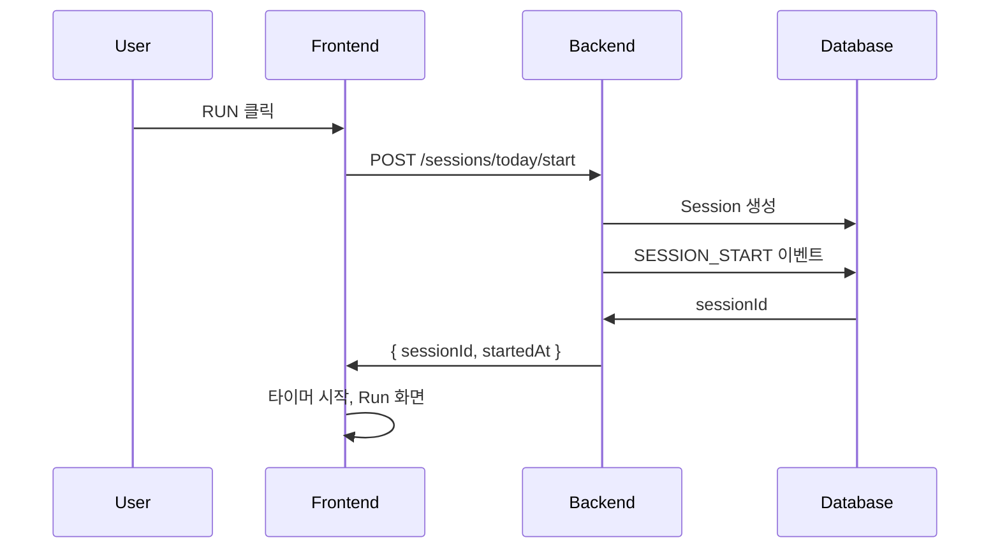
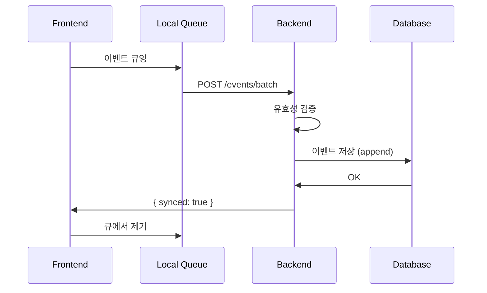
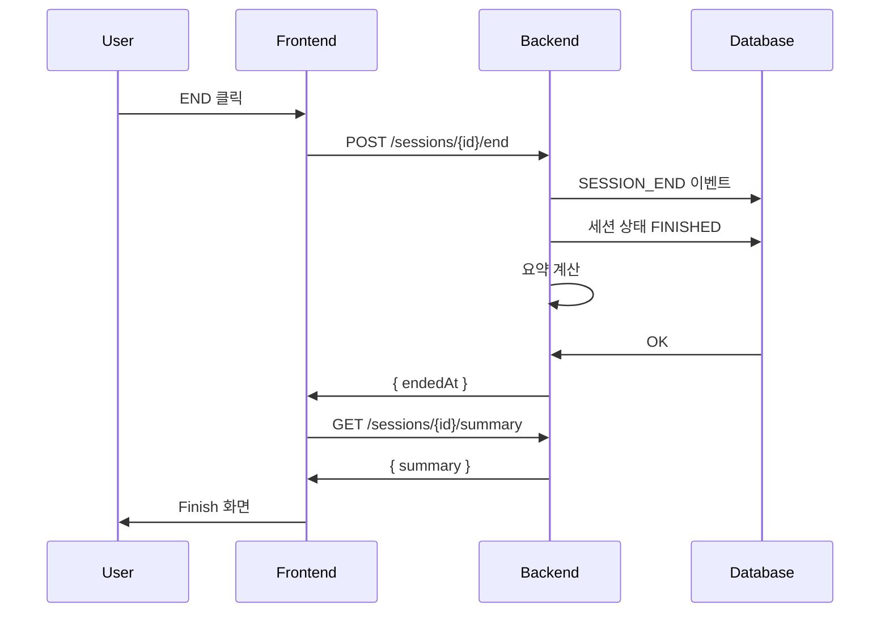
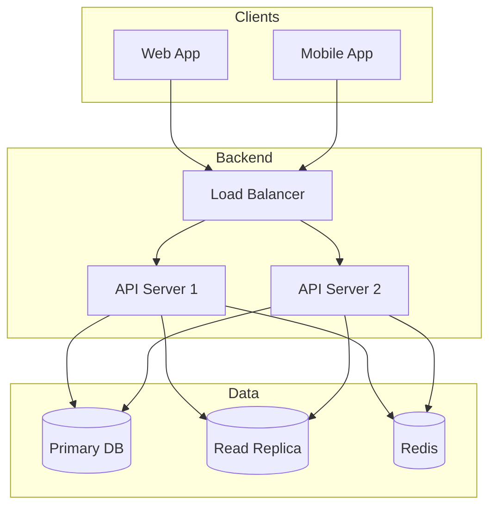

# System Architecture

## 1. 아키텍처 개요



---

## 2. 핵심 원칙

> **시간은 Frontend가 관리하고, Backend는 사실을 저장한다.**

| 영역 | Frontend | Backend |
|------|----------|---------|
| 타이머 | O | X |
| 상태 판단 | O | X |
| 애니메이션 | O | X |
| 이벤트 저장 | 임시 (로컬) | 영구 |
| 검증 | 기본 | 최종 |
| 요약 생성 | X | O |

---

## 3. Frontend 책임

### 3.1 상태 관리



| 책임 | 설명 |
|------|------|
| Run 상태 머신 | IDLE → RUNNING → FINISHING → FINISHED |
| 타이머 관리 | 경과 시간 계산, 표시 |
| 상태 전환 | 버튼 클릭 → 배경/캐릭터 변경 |
| 애니메이션 | 캐릭터 달리기, 배경 패럴랙스 |

### 3.2 오프라인 처리



| 책임 | 설명 |
|------|------|
| 이벤트 큐잉 | IndexedDB에 임시 저장 |
| 배치 전송 | 온라인 시 서버로 전송 |
| 재시도 | 실패 시 재전송 |
| 이탈 감지 | `visibilitychange` 이벤트 |

### 3.3 렌더링

| 책임 | 설명 |
|------|------|
| Live Preview | Settings에서 실시간 미리보기 |
| 테마 전환 | 상태별 배경 애니메이션 |
| 캐릭터 | 스프라이트 애니메이션 |
| 타임라인 | Finish/History 시각화 |

---

## 4. Backend 책임

### 4.1 API 서비스



| 책임 | 설명 |
|------|------|
| 인증 | JWT 발급/검증, Google OAuth |
| 설정 저장 | 사용자 커스터마이징 저장 |
| 세션 관리 | 생성, 종료, 조회 |
| 이벤트 저장 | append-only 저장 |
| 검증 | 설정/이벤트 유효성 검증 |

### 4.2 데이터 처리



| 책임 | 설명 |
|------|------|
| 유효성 검증 | 설정 범위, 이벤트 순서 |
| 중복 필터링 | idempotency key |
| 요약 생성 | 타임라인, 통계 계산 |

### 4.3 배치 작업



| 작업 | 주기 | 설명 |
|------|------|------|
| 24시간 자동 종료 | 매 시간 | 초과 세션 종료 |
| 7일 강제 종료 | 매일 | 자동 종료 OFF 세션 |

---

## 5. Backend가 하지 않는 것

| 항목 | 설명 |
|------|------|
| 타이머 실행 | 시간 계산은 Frontend |
| 상태 판단 | 현재 상태는 Frontend가 관리 |
| 자동 시작 | 사용자 명시적 RUN만 |
| 실시간 푸시 | 단방향 (Client → Server) |

---

## 6. 데이터 흐름

### 6.1 세션 시작



### 6.2 이벤트 전송



### 6.3 세션 종료



---

## 7. 보안

### 7.1 인증

| 항목 | 방식 |
|------|------|
| Access Token | JWT, 1시간 유효 |
| Refresh Token | HttpOnly Cookie, 7일 |
| API 인증 | Bearer Token |

### 7.2 데이터 보호

| 항목 | 방식 |
|------|------|
| 전송 | HTTPS 필수 |
| 세션 접근 | 본인 세션만 접근 가능 |
| 이벤트 | 수정/삭제 API 없음 |

---

## 8. 확장성 고려

### v1 (현재)

```
Frontend (SPA) → Backend (단일 서버) → PostgreSQL
```

### v2+ (확장)


