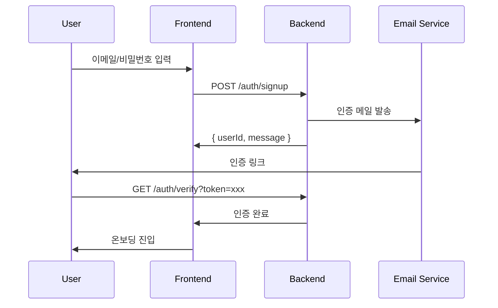
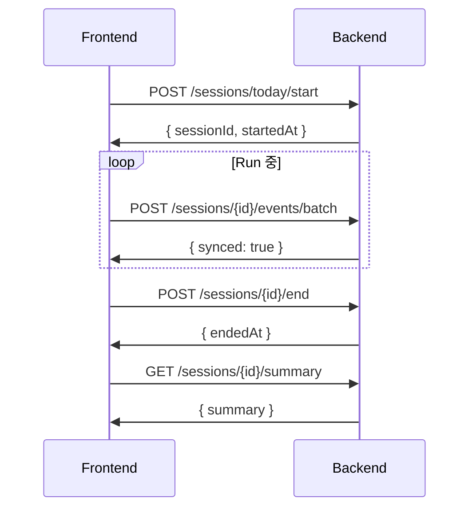

# API Specification (v1)

## 1. 개요

### 기본 정보

| 항목 | 값 |
|------|-----|
| Base URL | `https://api.runwork.app/v1` |
| 인증 | Bearer Token |
| Content-Type | `application/json` |

### 인증 헤더

```
Authorization: Bearer <access_token>
```

---

## 2. Authentication API

### 2.1 회원가입 플로우



### POST /auth/signup

이메일 회원가입

**Request:**

```json
{
  "email": "user@example.com",
  "password": "securePass123"
}
```

**Response (201):**

```json
{
  "message": "인증 메일이 발송되었습니다",
  "userId": "user_abc123"
}
```

**Validation:**
- email: 유효한 이메일 형식
- password: 최소 8자, 영문+숫자 조합

---

### POST /auth/login

이메일 로그인

**Request:**

```json
{
  "email": "user@example.com",
  "password": "securePass123"
}
```

**Response (200):**

```json
{
  "accessToken": "eyJhbG...",
  "refreshToken": "eyJhbG...",
  "expiresIn": 3600,
  "user": {
    "userId": "user_abc123",
    "email": "user@example.com",
    "onboardingCompleted": true
  }
}
```

---

### POST /auth/google

Google OAuth 로그인

**Request:**

```json
{
  "idToken": "google_id_token_here"
}
```

**Response (200):**

```json
{
  "accessToken": "eyJhbG...",
  "refreshToken": "eyJhbG...",
  "expiresIn": 3600,
  "isNewUser": true,
  "user": {
    "userId": "user_abc123",
    "email": "user@gmail.com",
    "onboardingCompleted": false
  }
}
```

---

### POST /auth/refresh

토큰 갱신

**Request:**

```json
{
  "refreshToken": "eyJhbG..."
}
```

**Response (200):**

```json
{
  "accessToken": "eyJhbG...",
  "expiresIn": 3600
}
```

---

### POST /auth/logout

로그아웃

**Response (200):**

```json
{
  "message": "로그아웃 완료"
}
```

---

### 토큰 정책

| 토큰 | 유효기간 | 저장 |
|------|----------|------|
| Access Token | 1시간 | 메모리 / HttpOnly Cookie |
| Refresh Token | 7일 | HttpOnly Cookie |

---

## 3. User API

### GET /me/profile

사용자 프로필 조회

**Response:**

```json
{
  "userId": "user_123",
  "email": "user@example.com",
  "onboardingCompleted": true,
  "createdAt": "2025-12-01T09:00:00Z"
}
```

---

### GET /me/settings

현재 커스터마이징 설정 조회

**Response:**

```json
{
  "version": 3,
  "characterId": "animal_cat",
  "actions": [
    {
      "slot": 0,
      "label": "일",
      "kind": "work",
      "themeId": "city_day",
      "pace": "fast"
    },
    {
      "slot": 1,
      "label": "휴식",
      "kind": "break",
      "themeId": "beach_sunset",
      "pace": "slow"
    }
  ]
}
```

---

### PUT /me/settings

커스터마이징 설정 저장

**Request:**

```json
{
  "characterId": "animal_cat",
  "actions": [
    {
      "slot": 0,
      "label": "일",
      "kind": "work",
      "themeId": "city_day",
      "pace": "fast"
    }
  ]
}
```

**Validation:**
- `actions.length` ≤ 5
- `slot`: 0~4, 중복 불가
- `label`: 최대 10자
- `themeId`, `characterId`: 제공 목록 내 값

**Response (200):**

```json
{
  "version": 4,
  "updatedAt": "2025-12-13T10:00:00Z"
}
```

---

### POST /me/onboarding/complete

온보딩 완료 기록

**Request:**

```json
{
  "characterId": "animal_cat",
  "completedAt": "2025-12-13T10:00:00Z"
}
```

**Response (200):**

```json
{
  "success": true,
  "defaultSettings": {
    "characterId": "animal_cat",
    "actions": [
      { "slot": 0, "label": "일", "kind": "work", "themeId": "city_day" },
      { "slot": 1, "label": "휴식", "kind": "break", "themeId": "park_morning" },
      { "slot": 2, "label": "기타", "kind": "neutral", "themeId": "beach_sunset" }
    ]
  }
}
```

---

## 4. Session API

### 4.1 세션 플로우



---

### POST /sessions/today/start

오늘의 Run 시작

**Response (201):**

```json
{
  "sessionId": "sess_123",
  "startedAt": "2025-12-13T09:01:00Z",
  "settingsVersion": 3
}
```

**Error:**
- `SESSION_ALREADY_EXISTS`: 오늘 이미 세션 존재

---

### POST /sessions/{sessionId}/events/batch

이벤트 배치 전송

**Request:**

```json
[
  {
    "localId": "evt_local_001",
    "ts": "2025-12-13T09:10:00Z",
    "type": "ACTION_SWITCH",
    "payload": {
      "actionSlot": 1,
      "label": "휴식"
    }
  },
  {
    "localId": "evt_local_002",
    "ts": "2025-12-13T10:30:00Z",
    "type": "NOTE_ADD",
    "payload": {
      "content": "집중 잘 됨"
    }
  }
]
```

**Event Types:**

| type | payload |
|------|---------|
| ACTION_SWITCH | `{ actionSlot, label }` |
| NOTE_ADD | `{ content }` |

**Rules:**
- `ts`는 세션 시작 이후여야 함
- 시간순 정렬 필요 없음 (서버에서 정렬)
- `localId`로 중복 방지

**Response (200):**

```json
{
  "synced": true,
  "syncedCount": 2
}
```

---

### POST /sessions/{sessionId}/end

하루 종료

**Response (200):**

```json
{
  "endedAt": "2025-12-13T22:40:00Z"
}
```

---

### GET /sessions/{sessionId}/summary

하루 요약 조회

**Response:**

```json
{
  "sessionId": "sess_123",
  "date": "2025-12-13",
  "startedAt": "2025-12-13T09:01:00Z",
  "endedAt": "2025-12-13T22:40:00Z",
  "totalDuration": 49140,
  "timeline": [
    {
      "startAt": "2025-12-13T09:01:00Z",
      "endAt": "2025-12-13T12:30:00Z",
      "action": {
        "slot": 0,
        "label": "일",
        "kind": "work",
        "themeId": "city_day"
      },
      "duration": 12540
    }
  ],
  "actionSummary": [
    {
      "label": "일",
      "kind": "work",
      "totalDuration": 28800,
      "percentage": 58.6
    }
  ],
  "notes": [
    {
      "ts": "2025-12-13T10:30:00Z",
      "content": "집중 잘 됨"
    }
  ],
  "finishMessage": "오늘도 끝까지 달렸어요!",
  "endType": "manual"
}
```

| endType | 설명 |
|---------|------|
| manual | 사용자 END 클릭 |
| auto_24h | 24시간 자동 종료 |
| auto_timeout | 7일 강제 종료 |

---

## 5. Recovery API

### GET /sessions/active

현재 활성 세션 조회 (앱 복귀 시)

**Response (활성 세션 있음):**

```json
{
  "hasActiveSession": true,
  "session": {
    "sessionId": "sess_123",
    "startedAt": "2025-12-13T09:01:00Z",
    "lastEventAt": "2025-12-13T14:30:00Z",
    "currentAction": {
      "slot": 0,
      "label": "일",
      "kind": "work"
    },
    "elapsedSinceLastEvent": 36000
  }
}
```

**Response (활성 세션 없음):**

```json
{
  "hasActiveSession": false,
  "session": null
}
```

---

### POST /sessions/{sessionId}/recovery

복귀 시 기록 조정

**Request:**

```json
{
  "action": "adjust",
  "adjustment": {
    "type": "mark_as_break",
    "gapStart": "2025-12-13T14:30:00Z",
    "gapEnd": "2025-12-14T00:53:00Z"
  }
}
```

**action 옵션:**

| action | 설명 |
|--------|------|
| continue | 이어서 계속 (조정 없음) |
| end_at_last | 마지막 활동 시점에 종료 |
| adjust | 기록 조정 (adjustment 필수) |

**adjustment.type 옵션:**

| type | 설명 |
|------|------|
| mark_as_break | 해당 시간을 휴식으로 |
| mark_as_work | 해당 시간을 작업으로 |
| exclude | 기록에서 제외 |

---

## 6. History API

### GET /sessions/history

월별 세션 목록 조회

**Query Parameters:**
- `year` (필수): 연도
- `month` (필수): 월

**Response:**

```json
{
  "year": 2025,
  "month": 12,
  "sessions": [
    {
      "sessionId": "sess_001",
      "date": "2025-12-05",
      "status": "FINISHED",
      "totalDuration": 30720,
      "primaryAction": "work",
      "previewTimeline": [
        { "kind": "work", "percent": 40 },
        { "kind": "break", "percent": 20 },
        { "kind": "work", "percent": 40 }
      ]
    }
  ],
  "summary": {
    "totalDays": 12,
    "currentStreak": 3,
    "longestStreak": 5
  }
}
```

---

### GET /sessions/{sessionId}/detail

특정 날의 상세 기록 (History에서 사용)

**Response:** `GET /sessions/{sessionId}/summary`와 동일

---

## 7. Asset API

### GET /assets/themes

테마 목록 조회

**Response:**

```json
{
  "themes": [
    {
      "themeId": "city_day",
      "name": "도시의 낮",
      "description": "활기찬 도시를 달리세요",
      "previewUrl": "/assets/themes/city_day/preview.png"
    }
  ]
}
```

---

### GET /assets/characters

캐릭터 목록 조회

**Response:**

```json
{
  "characters": [
    {
      "characterId": "animal_cat",
      "name": "달리는 고양이",
      "type": "animal",
      "previewUrl": "/assets/characters/cat/preview.gif"
    }
  ]
}
```

---

## 8. 공통 규칙

### Rate Limiting

| 엔드포인트 | 제한 |
|-----------|------|
| /auth/* | 분당 20회 |
| 기타 | 분당 100회 |

### 보안

- 모든 API는 HTTPS 필수
- 로그인 실패 시 구체적 사유 미노출
- 연속 5회 실패 시 5분 잠금
