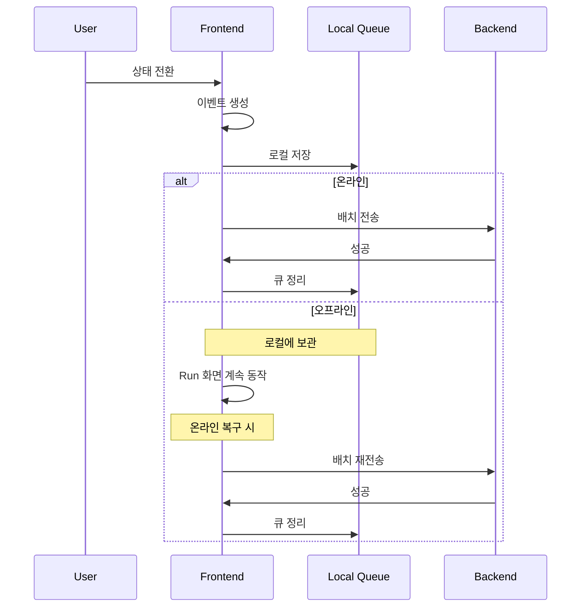
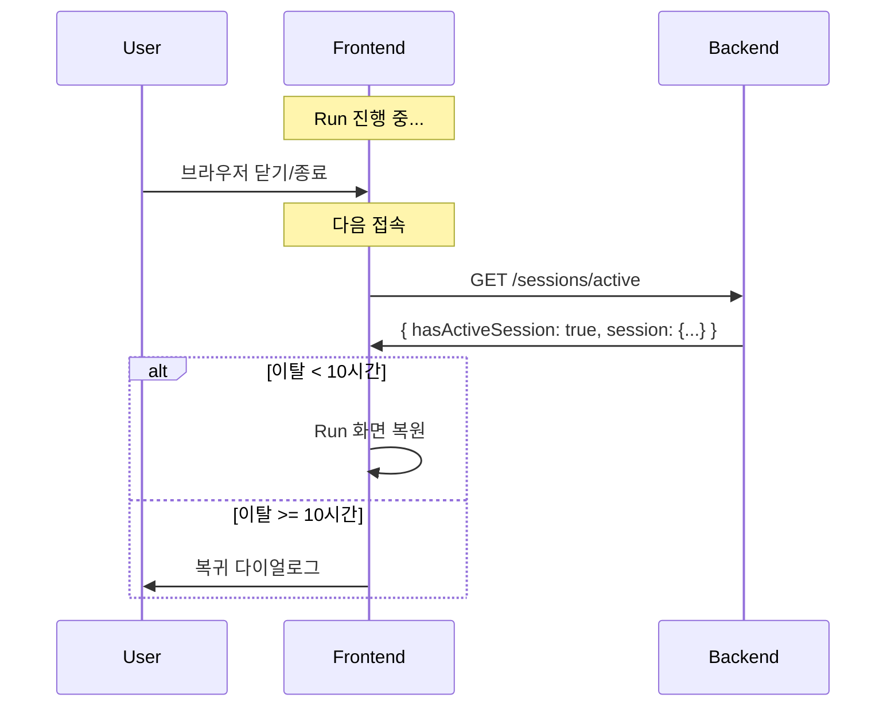
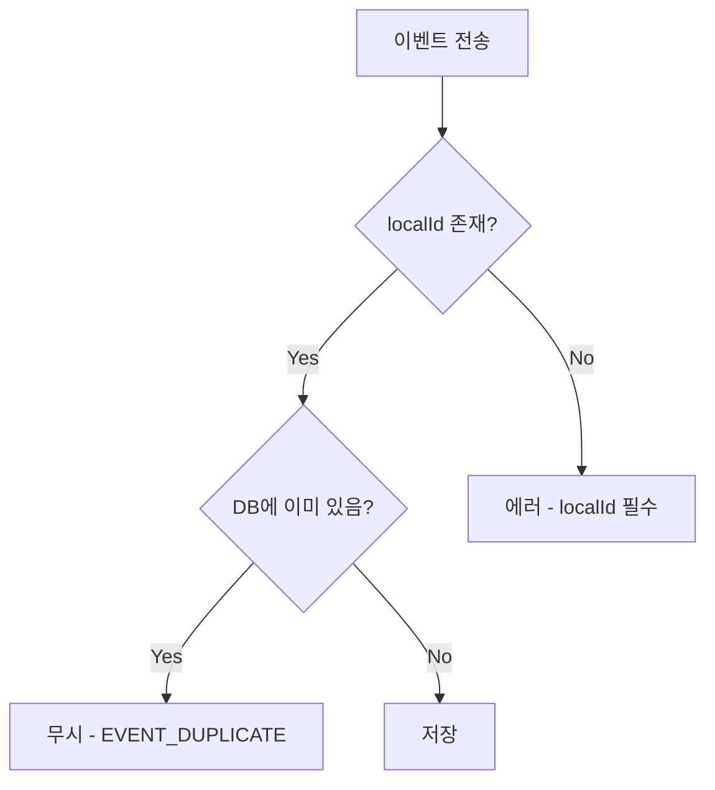
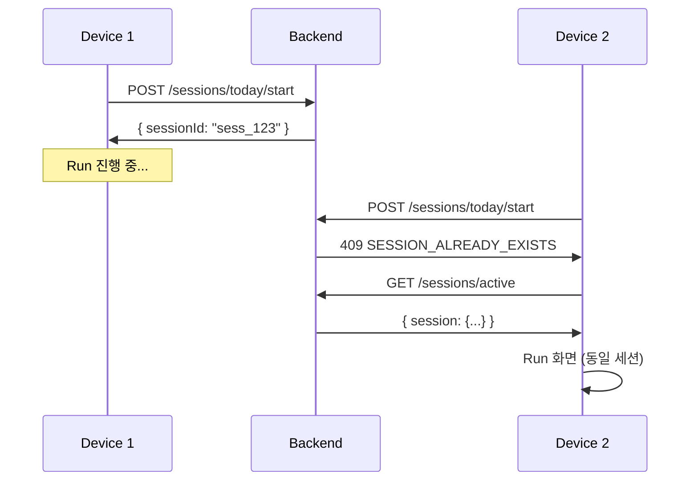
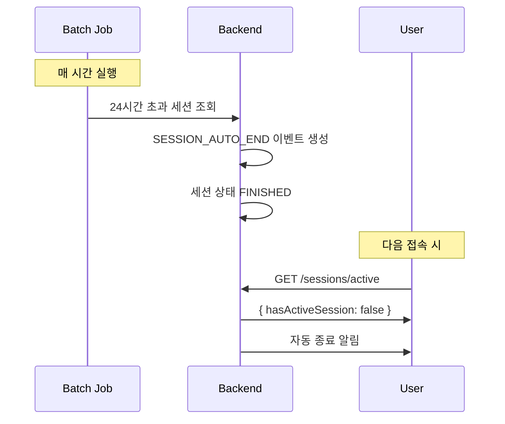
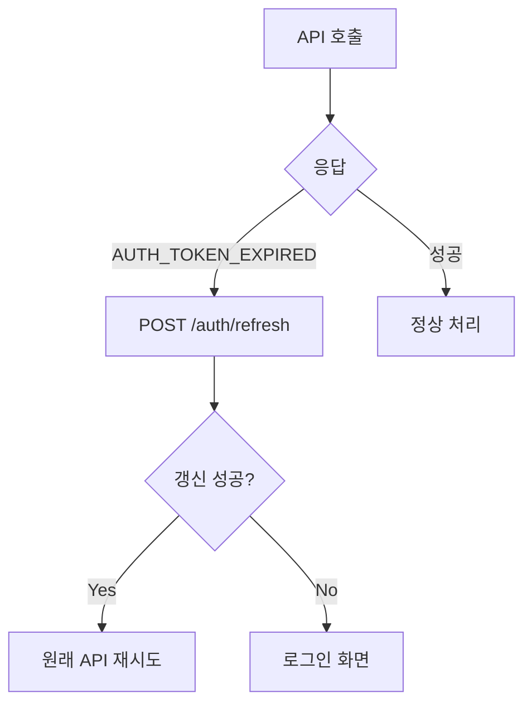

# Error Handling & Edge Cases

## 1. 에러 응답 형식

모든 API 에러는 일관된 형식으로 반환된다.

```json
{
  "error": {
    "code": "AUTH_TOKEN_EXPIRED",
    "message": "인증 토큰이 만료되었습니다",
    "details": {}
  }
}
```

| 필드 | 타입 | 설명 |
|------|------|------|
| code | string | 에러 식별 코드 (클라이언트 처리용) |
| message | string | 사용자 표시용 메시지 (한글) |
| details | object | 추가 정보 (선택적) |

---

## 2. HTTP 상태 코드

| HTTP | 용도 | 재시도 |
|------|------|--------|
| 400 | 잘못된 요청 (유효성 검사 실패) | X |
| 401 | 인증 필요 / 인증 실패 | 토큰 갱신 후 |
| 403 | 권한 없음 | X |
| 404 | 리소스 없음 | X |
| 409 | 충돌 (중복 등) | X |
| 422 | 처리 불가 (비즈니스 로직 오류) | X |
| 429 | 요청 제한 초과 | 대기 후 |
| 500 | 서버 오류 | O (최대 3회) |

---

## 3. 에러 코드 목록

### 3.1 인증 에러 (AUTH_*)

| 코드 | HTTP | 메시지 |
|------|------|--------|
| AUTH_REQUIRED | 401 | 로그인이 필요합니다 |
| AUTH_TOKEN_EXPIRED | 401 | 인증이 만료되었습니다 |
| AUTH_TOKEN_INVALID | 401 | 유효하지 않은 인증입니다 |
| AUTH_CREDENTIALS_INVALID | 401 | 이메일 또는 비밀번호가 올바르지 않습니다 |
| AUTH_EMAIL_NOT_VERIFIED | 403 | 이메일 인증이 필요합니다 |
| AUTH_ACCOUNT_LOCKED | 403 | 계정이 잠겼습니다. 5분 후 다시 시도해주세요 |
| AUTH_GOOGLE_FAILED | 401 | Google 로그인에 실패했습니다 |

### 3.2 회원가입 에러 (SIGNUP_*)

| 코드 | HTTP | 메시지 |
|------|------|--------|
| SIGNUP_EMAIL_EXISTS | 409 | 이미 사용 중인 이메일입니다 |
| SIGNUP_EMAIL_INVALID | 400 | 올바른 이메일 형식이 아닙니다 |
| SIGNUP_PASSWORD_WEAK | 400 | 비밀번호는 8자 이상, 영문+숫자 조합이어야 합니다 |

### 3.3 세션 에러 (SESSION_*)

| 코드 | HTTP | 메시지 |
|------|------|--------|
| SESSION_NOT_FOUND | 404 | 세션을 찾을 수 없습니다 |
| SESSION_ALREADY_EXISTS | 409 | 오늘의 달리기가 이미 진행 중입니다 |
| SESSION_ALREADY_ENDED | 422 | 이미 종료된 달리기입니다 |
| SESSION_NOT_RUNNING | 422 | 진행 중인 달리기가 없습니다 |
| SESSION_BELONGS_TO_OTHER | 403 | 접근 권한이 없습니다 |

### 3.4 이벤트 에러 (EVENT_*)

| 코드 | HTTP | 메시지 |
|------|------|--------|
| EVENT_TIMESTAMP_INVALID | 400 | 이벤트 시간이 유효하지 않습니다 |
| EVENT_TYPE_UNKNOWN | 400 | 알 수 없는 이벤트 유형입니다 |
| EVENT_PAYLOAD_INVALID | 400 | 이벤트 데이터가 올바르지 않습니다 |
| EVENT_DUPLICATE | 409 | 이미 처리된 이벤트입니다 |

### 3.5 설정 에러 (SETTINGS_*)

| 코드 | HTTP | 메시지 |
|------|------|--------|
| SETTINGS_ACTIONS_LIMIT | 400 | 버튼은 최대 5개까지 설정 가능합니다 |
| SETTINGS_SLOT_DUPLICATE | 400 | 중복된 슬롯이 있습니다 |
| SETTINGS_SLOT_INVALID | 400 | 슬롯 번호는 0~4 사이여야 합니다 |
| SETTINGS_THEME_INVALID | 400 | 존재하지 않는 테마입니다 |
| SETTINGS_CHARACTER_INVALID | 400 | 존재하지 않는 캐릭터입니다 |
| SETTINGS_LABEL_TOO_LONG | 400 | 버튼 이름은 10자 이하여야 합니다 |

### 3.6 노트 에러 (NOTE_*)

| 코드 | HTTP | 메시지 |
|------|------|--------|
| NOTE_CONTENT_EMPTY | 400 | 메모 내용을 입력해주세요 |
| NOTE_CONTENT_TOO_LONG | 400 | 메모는 200자 이하로 작성해주세요 |

### 3.7 복구 에러 (RECOVERY_*)

| 코드 | HTTP | 메시지 |
|------|------|--------|
| RECOVERY_NO_ACTIVE_SESSION | 404 | 복구할 세션이 없습니다 |
| RECOVERY_INVALID_ACTION | 400 | 올바르지 않은 복구 옵션입니다 |
| RECOVERY_GAP_INVALID | 400 | 조정 시간 범위가 올바르지 않습니다 |

### 3.8 일반 에러 (GENERAL_*)

| 코드 | HTTP | 메시지 |
|------|------|--------|
| GENERAL_RATE_LIMITED | 429 | 요청이 너무 많습니다. 잠시 후 다시 시도해주세요 |
| GENERAL_INTERNAL_ERROR | 500 | 서버 오류가 발생했습니다 |
| GENERAL_MAINTENANCE | 503 | 서비스 점검 중입니다 |

---

## 4. Edge Cases

### 4.1 네트워크 장애



**처리 방식:**
- Frontend는 이벤트를 **로컬 큐(IndexedDB)**에 저장
- 네트워크 복구 시 batch 전송
- UI는 네트워크 상태와 무관하게 **즉시 반영**

---

### 4.2 앱 종료 중 Run 진행



**처리 방식:**
- 재접속 시 `GET /sessions/active` 호출
- 세션 상태가 RUNNING이면 Run 화면 복원
- 마지막 이벤트 이후 시간에 따라 복귀 다이얼로그 표시

---

### 4.3 중복 이벤트



**처리 방식:**
- Backend는 `localId`(idempotency key)로 중복 방지
- 동일 localId 이벤트는 무시 (저장하지 않음)
- 클라이언트는 `EVENT_DUPLICATE` 에러 시 성공으로 처리

---

### 4.4 동시 기기 접속



**처리 방식:**
- 하루에 세션은 **하나만** 존재
- 다른 기기에서 시작 시도 시 `SESSION_ALREADY_EXISTS`
- 기존 세션 정보 조회 후 같은 세션에 참여

---

### 4.5 잘못된 설정 저장 시도

**처리 방식:**
- 서버에서 검증 후 명확한 에러 코드 반환
- Frontend는 에러 메시지를 사용자에게 표시
- 저장 거부됨, 이전 설정 유지

---

### 4.6 24시간 초과 세션



**처리 방식:**
- 서버 배치 작업이 24시간 초과 세션 자동 종료
- 다음 접속 시 "어제의 달리기가 자동으로 마무리되었어요" 알림

---

## 5. 클라이언트 에러 처리 가이드

### 5.1 자동 재시도

| 에러 | 처리 |
|------|------|
| GENERAL_RATE_LIMITED | 지수 백오프 (1s, 2s, 4s...) |
| GENERAL_INTERNAL_ERROR | 최대 3회 재시도 |
| EVENT_DUPLICATE | 무시하고 진행 (이미 성공) |

### 5.2 토큰 갱신



### 5.3 로그인 화면 이동

| 에러 | 처리 |
|------|------|
| AUTH_REQUIRED | 로그인 화면 |
| AUTH_TOKEN_INVALID | 로그인 화면 |
| AUTH_ACCOUNT_LOCKED | 에러 메시지 + 대기 |

### 5.4 사용자 메시지 표시

- 위 케이스 외 모든 에러: `message` 필드를 토스트/알림으로 표시
- 사용자가 이해할 수 있는 한글 메시지 제공

---

## 6. 로깅 및 모니터링

### Frontend 로깅

```typescript
// 에러 발생 시 로깅
const handleError = (error: ApiError) => {
  console.error('[API Error]', {
    code: error.code,
    message: error.message,
    endpoint: error.endpoint,
    timestamp: new Date().toISOString()
  });

  // 사용자 알림
  showToast(error.message);
};
```

### Backend 로깅

| 레벨 | 대상 |
|------|------|
| ERROR | 500 에러, 예외 발생 |
| WARN | 401/403 에러, Rate Limit |
| INFO | API 호출 기록 |
| DEBUG | 상세 디버그 정보 |
