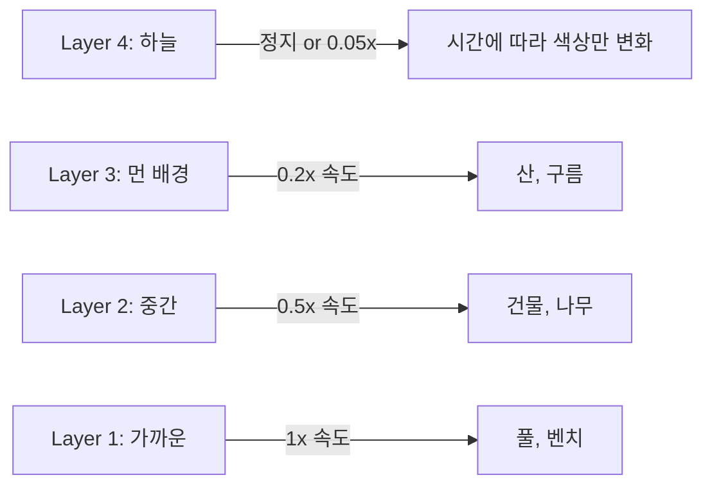
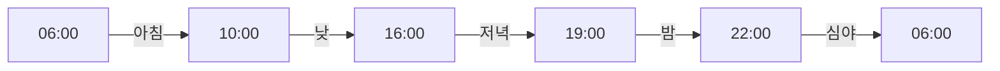
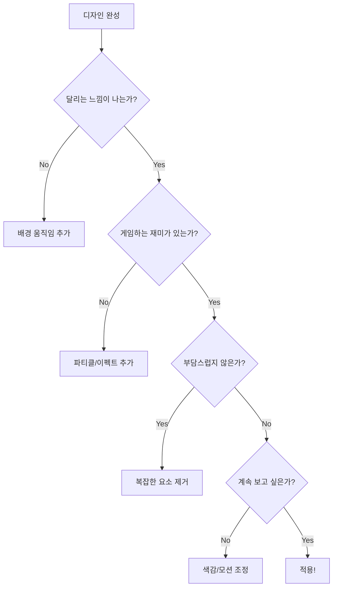

# Design System & Visual Guidelines

## 1. 디자인 철학

### 비주얼 컨셉: "Cozy Runner"

> 러닝 게임을 하듯 달리고, 한강을 뛰듯 편안하게.
> 게임적 재미와 러닝의 흐름이 공존하는 경험.

**두 가지 축:**

```
게임적 재미 ←――――――――――――→ 러닝의 흐름
 (성취감, 수집, 귀여움)        (바람, 풍경, 리듬)
           ↓
      "Cozy Runner"
```

### 목표하는 감정

| 게임에서 오는 것 | 러닝에서 오는 것 |
|-----------------|-----------------|
| 캐릭터 수집의 재미 | 풍경이 흘러가는 시원함 |
| 마일스톤 달성 성취감 | 바람이 스치는 상쾌함 |
| 귀여운 비주얼 | 부담 없는 가벼움 |
| "오늘도 뛰었다" 보상감 | "그냥 달린다" 몰입감 |

### 레퍼런스

| 게임 | 참고 요소 |
|------|----------|
| **Alto's Odyssey** | 부드러운 그라데이션 하늘, 패럴랙스 배경, 시간대 변화 |
| **Canabalt** | 미니멀 실루엣, 속도감 있는 스크롤 |
| **Crossy Road** | 팝한 캐릭터, 수집 재미 |
| **Monument Valley** | 차분한 색감, 정교한 디테일 |

### 핵심 키워드

| 키워드 | 설명 | 시각적 표현 |
|--------|------|------------|
| **흐름** | 끊기지 않는 연속적 움직임 | 패럴랙스 스크롤, 무한 배경 |
| **바람** | 가볍고 시원한 느낌 | 바람 라인 파티클, 흔들리는 요소 |
| **풍경** | 계속 변화하는 시각 요소 | 시간대별 배경, 지나가는 오브젝트 |
| **리듬** | 일정한 박자의 안정감 | 캐릭터 달리기 모션, 규칙적 타이밍 |

---

## 2. 비주얼 스타일

### 2.1 스타일 정의

**"Soft Vector + Motion"**

| 요소 | 스타일 | 설명 |
|------|--------|------|
| **캐릭터** | 단순한 벡터 실루엣 | 둥글둥글, 귀여움, 2~3가지 주요 색상 |
| **배경** | 레이어드 그라데이션 | 하늘, 산, 건물이 각각 다른 속도로 흐름 |
| **오브젝트** | 도형 기반 단순화 | 나무, 건물, 벤치 등 심플한 형태 |
| **이펙트** | 파티클 + 라인 | 바람, 빛, 먼지로 생동감 |

### 2.2 캐릭터 스타일

```
[스타일 가이드]

    ╭──────╮
   ╭│ ◕  ◕ │╮     ← 단순한 얼굴, 큰 눈
   ││      ││
   │╰──────╯│     ← 둥근 실루엣
   │  ╲  ╱  │
   ╰────────╯
      │  │        ← 심플한 팔다리
     ╱    ╲

특징:
- 아웃라인 없음 또는 얇은 아웃라인
- 부드러운 곡선
- 2~4가지 색상
- 64~96px 크기
```

### 2.3 배경 레이어 구조

```
┌─────────────────────────────────────────────────────┐
│ Layer 4: 하늘 (고정 또는 매우 느림)                    │
│   ░░░▒▒▒▓▓▓  그라데이션                              │
├─────────────────────────────────────────────────────┤
│ Layer 3: 먼 배경 (0.2x 속도)                         │
│   산, 구름, 먼 건물                                  │
├─────────────────────────────────────────────────────┤
│ Layer 2: 중간 배경 (0.5x 속도)                       │
│   나무, 건물, 가로등                                 │
├─────────────────────────────────────────────────────┤
│ Layer 1: 가까운 배경 (1x 속도)                       │
│   풀, 벤치, 지나가는 사람                            │
├─────────────────────────────────────────────────────┤
│ Layer 0: 지면 (1x 속도)                              │
│   길, 트랙                                          │
├─────────────────────────────────────────────────────┤
│ Character Layer                                     │
│   캐릭터 (고정 위치, 달리기 애니메이션)                │
├─────────────────────────────────────────────────────┤
│ Effect Layer                                        │
│   바람 라인, 먼지 파티클                             │
└─────────────────────────────────────────────────────┘
```

### 2.4 파티클 이펙트

| 이펙트 | 용도 | 스타일 |
|--------|------|--------|
| **Wind Lines** | 달리는 속도감 | 수평 얇은 선, 투명도 변화 |
| **Dust** | 발자국 효과 | 작은 원, 위로 퍼지며 사라짐 |
| **Sparkle** | 상태 전환 강조 | 작은 별, 반짝이며 사라짐 |
| **Leaves** | 계절감, 바람 | 나뭇잎 형태, 흔들리며 이동 |

---

## 3. 컬러 시스템

### 3.1 Primary Colors

| 이름 | HEX | 용도 |
|------|-----|------|
| Primary | `#FF6B6B` | 메인 액션 (RUN, END) |
| Primary Dark | `#E55555` | 버튼 hover/pressed |
| Primary Light | `#FF8A8A` | 배경 강조 |

### 3.2 Neutral Colors

| 이름 | HEX | 용도 |
|------|-----|------|
| Background | `#FFFDF7` | 메인 배경 (따뜻한 화이트) |
| Surface | `#FFF8E7` | 카드, 모달 배경 |
| Border | `#E8E0D0` | 구분선, 테두리 |
| Text Primary | `#2D2D2D` | 본문 텍스트 |
| Text Secondary | `#6B6B6B` | 보조 텍스트 |
| Text Disabled | `#B0B0B0` | 비활성 텍스트 |

### 3.3 Action Kind Colors

| 상태 | Color | HEX | 설명 |
|------|-------|-----|------|
| work | Coral | `#FF6B6B` | 집중, 작업 |
| break | Mint | `#6BCFCF` | 휴식, 여유 |
| neutral | Lavender | `#A8A4E6` | 기타, 중립 |

### 3.4 테마별 하늘 그라데이션

| 테마 | 상단 | 중단 | 하단 |
|------|------|------|------|
| city_day | `#87CEEB` | `#B0E0E6` | `#F0F8FF` |
| city_night | `#1A1A2E` | `#16213E` | `#0F3460` |
| park_morning | `#FFE4B5` | `#FFDAB9` | `#87CEEB` |
| beach_sunset | `#FF6B6B` | `#FFA07A` | `#FFD700` |
| mountain_twilight | `#4B0082` | `#663399` | `#FF8C00` |

### 3.5 Semantic Colors

| 이름 | HEX | 용도 |
|------|-----|------|
| Success | `#6BCF8E` | 성공, 완료 |
| Warning | `#FFB86B` | 경고, 주의 |
| Error | `#FF6B6B` | 에러, 실패 |
| Info | `#6B9FFF` | 정보, 안내 |

---

## 4. 타이포그래피

### 4.1 폰트 패밀리

| 용도 | 폰트 | Fallback |
|------|------|----------|
| UI/본문 | Pretendard | -apple-system, sans-serif |
| 숫자/타이머 | D2Coding | monospace |

### 4.2 폰트 스케일

| 이름 | Size | Weight | Line Height | 용도 |
|------|------|--------|-------------|------|
| Display | 32px | 700 | 1.2 | 큰 제목 |
| Heading 1 | 24px | 700 | 1.3 | 화면 제목 |
| Heading 2 | 20px | 600 | 1.3 | 섹션 제목 |
| Heading 3 | 16px | 600 | 1.4 | 소제목 |
| Body | 14px | 400 | 1.5 | 본문 |
| Caption | 12px | 400 | 1.4 | 보조 텍스트 |
| Timer | 24px | 500 | 1.0 | 타이머 숫자 |

---

## 5. 애니메이션 시스템

### 5.1 배경 스크롤



**속도 기준:**
- 기본 속도: 100px/sec
- `work` 상태: 1.2x (더 빠르게)
- `break` 상태: 0.5x (느리게)
- `idle` 상태: 0.3x (거의 정지)

### 5.2 캐릭터 모션

| 상태 | 모션 | 프레임 | FPS |
|------|------|--------|-----|
| `work` | 빠른 달리기 | 6 | 12 |
| `break` | 걷기/조깅 | 6 | 6 |
| `idle` | 제자리 뛰기 | 4 | 4 |
| `finish` | 멈춤 → 스트레칭 | 8 | 8 |

### 5.3 파티클 타이밍

| 이펙트 | 생성 주기 | 지속 시간 | 개수 |
|--------|----------|----------|------|
| Wind Lines | 100ms | 500ms | 3~5개 |
| Dust | 200ms | 400ms | 2~3개 |
| Sparkle | 이벤트 시 | 600ms | 5~8개 |

### 5.4 시간대 변화



| 시간대 | 하늘 톤 | 오브젝트 변화 |
|--------|--------|--------------|
| 새벽 (05-07) | 연한 핑크/오렌지 | 가로등 켜짐 |
| 아침 (07-10) | 밝은 파랑/노랑 | 새, 운동하는 사람 |
| 낮 (10-16) | 선명한 파랑 | 구름, 자전거 |
| 저녁 (16-19) | 오렌지/핑크 | 노을, 귀가하는 사람 |
| 밤 (19-05) | 짙은 남색/보라 | 달, 별, 불빛 |

---

## 6. 레이아웃 시스템

### 6.1 Run Screen 구조

```
┌─────────────────────────────────────────┐
│ Header (56px)                    Timer  │
│   [☰]        12월 13일          02:34   │
├─────────────────────────────────────────┤
│                                         │
│         ░░░▒▒▒▓▓▓ (하늘)                │
│      🌳    🏢      🌳    (배경)          │
│    ────────────────────── (길)          │
│              🏃‍♂️                        │
│         ∿ ∿ ∿ (바람)                    │
│                                         │
│         Game Area (flex: 1)             │
│                                         │
├─────────────────────────────────────────┤
│ ┌─────────────────────────────────────┐ │
│ │ 오늘의 한 마디...                    │ │
│ └─────────────────────────────────────┘ │
├─────────────────────────────────────────┤
│  ┌────┐ ┌────┐ ┌────┐ ┌────┐ ┌────┐    │
│  │ 일 │ │휴식│ │회의│ │이동│ │기타│    │
│  └────┘ └────┘ └────┘ └────┘ └────┘    │
├─────────────────────────────────────────┤
│           ┌─────────────┐               │
│           │     END     │               │
│           └─────────────┘               │
└─────────────────────────────────────────┘
```

### 6.2 Spacing Scale

| Token | Value | 용도 |
|-------|-------|------|
| space-xs | 4px | 아이콘 내부 |
| space-sm | 8px | 요소 간 간격 |
| space-md | 16px | 섹션 내 간격 |
| space-lg | 24px | 섹션 간 간격 |
| space-xl | 32px | 영역 간 간격 |

---

## 7. 컴포넌트 스타일

### 7.1 버튼

**Primary Button (RUN, END)**
```
┌─────────────────────────────────────┐
│                                     │
│              RUN                    │
│                                     │
└─────────────────────────────────────┘

- Background: Primary (#FF6B6B)
- Text: White (#FFFFFF)
- Border Radius: 12px
- Height: 56px
- Shadow: 0 4px 12px rgba(255,107,107,0.3)
```

**Action Button (상태 전환)**
```
┌──────────┐  ┌──────────┐  ┌──────────┐
│    일    │  │   휴식   │  │   기타   │
└──────────┘  └──────────┘  └──────────┘

- Background: Surface (#FFF8E7)
- Border: 2px solid Border (#E8E0D0)
- Border Radius: 8px
- Height: 48px

[Active State]
- Background: Kind Color
- Border: 2px solid Kind Color
- Text: White
```

### 7.2 타임라인 바

```
┌─────────────────────────────────────┐
│ ████████░░░░░████████████░░░░████  │
│   work   break    work     break   │
└─────────────────────────────────────┘

- Height: 24px
- Border Radius: 12px
- Background: Border (#E8E0D0)
- Segments: Kind Colors with 2px gap
```

---

## 8. 게임적 요소

### 8.1 거리 표현

| 실제 시간 | 게임 내 표현 |
|----------|-------------|
| 1시간 | 약 1km |
| 8시간 | 약 8km |
| 24시간 | 마라톤 완주! (42km) |

### 8.2 마일스톤

| 거리 | 피드백 |
|------|--------|
| 1km | 작은 파티클 이펙트 |
| 5km | "Good pace!" 텍스트 |
| 10km | 배경에 랜드마크 등장 |
| 마라톤 | 골인 애니메이션 |

### 8.3 캐릭터 수집

- 기본 캐릭터 3종 제공
- 연속 달리기 달성 시 언락
- Settings에서 교체 가능

---

## 9. 반응형 가이드

### 9.1 Breakpoints

| 이름 | Range | 타겟 |
|------|-------|------|
| mobile | <768px | 스마트폰 |
| tablet | 768~1024px | 태블릿 |
| desktop | >1024px | 데스크탑 |

### 9.2 적응형 요소

| 요소 | Mobile | Tablet | Desktop |
|------|--------|--------|---------|
| 캐릭터 크기 | 64px | 80px | 96px |
| 게임 영역 비율 | 50% | 55% | 60% |
| 버튼 높이 | 48px | 52px | 56px |
| 배경 레이어 수 | 3 | 4 | 5 |

---

## 10. 접근성

### 10.1 모션 감소

```css
@media (prefers-reduced-motion: reduce) {
  /* 배경 스크롤 정지, 파티클 비활성화 */
  .parallax-layer { animation: none; }
  .particle { display: none; }

  /* 캐릭터는 정적 이미지로 대체 */
  .character { animation: none; }
}
```

### 10.2 컬러 대비

| 조합 | 대비율 | 기준 |
|------|--------|------|
| Text Primary / Background | 12.5:1 | ✓ AAA |
| Primary / White | 4.5:1 | ✓ AA |

### 10.3 터치 타겟

- 최소 터치 영역: **44×44px**
- 버튼 간 간격: 최소 **8px**

---

## 11. 디자인 체크리스트

### 화면을 만들 때 확인할 것



### 하지 말아야 할 것

| 금지 | 이유 |
|------|------|
| 정적인 화면 | 달리는 느낌이 사라짐 |
| 과한 이펙트 | 정신없고 부담스러움 |
| 복잡한 UI | 게임 몰입이 깨짐 |
| 숫자 강조 | 평가받는 느낌 |
| 딱딱한 도형 | 러닝의 부드러움 상실 |

---

## 12. 다크 모드 (v2+)

> v1에서는 라이트 모드만 지원. 다크 모드는 v2에서 추가 예정.

### 예정 팔레트

| Token | Light | Dark |
|-------|-------|------|
| Background | #FFFDF7 | #1A1A1A |
| Surface | #FFF8E7 | #2D2D2D |
| Text Primary | #2D2D2D | #F5F5F5 |
| Border | #E8E0D0 | #404040 |
