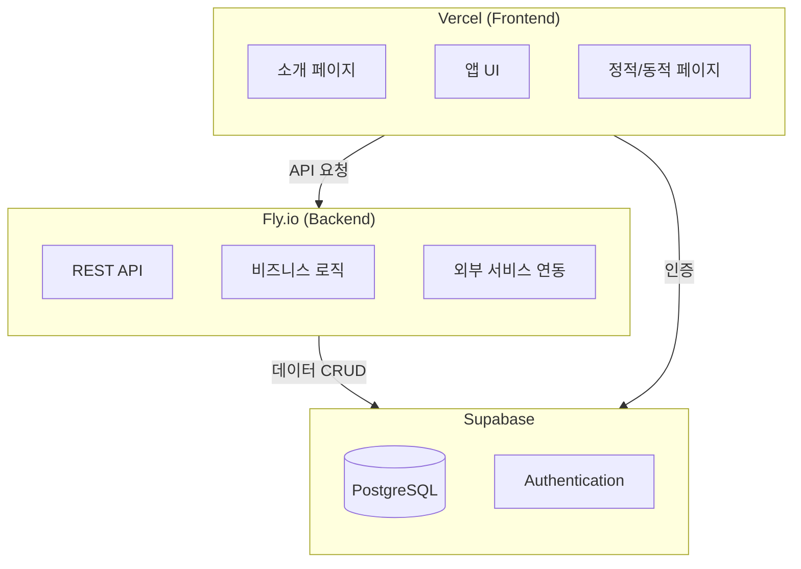
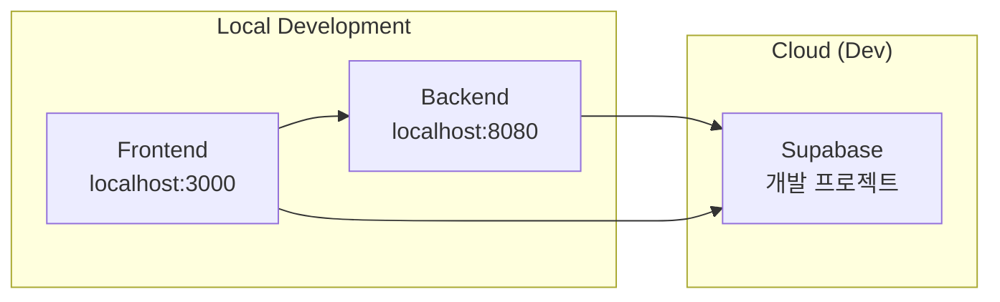
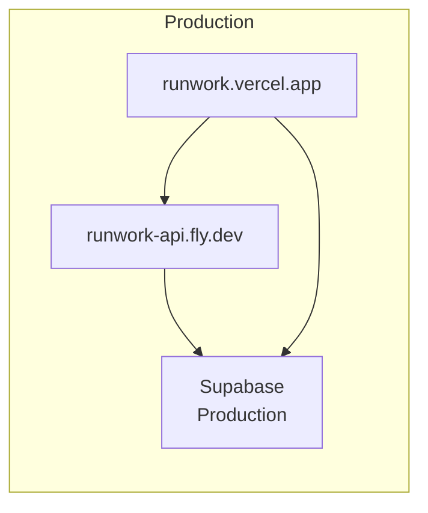
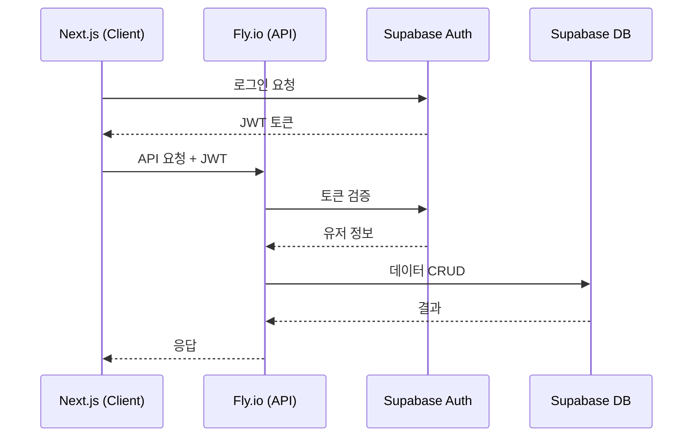
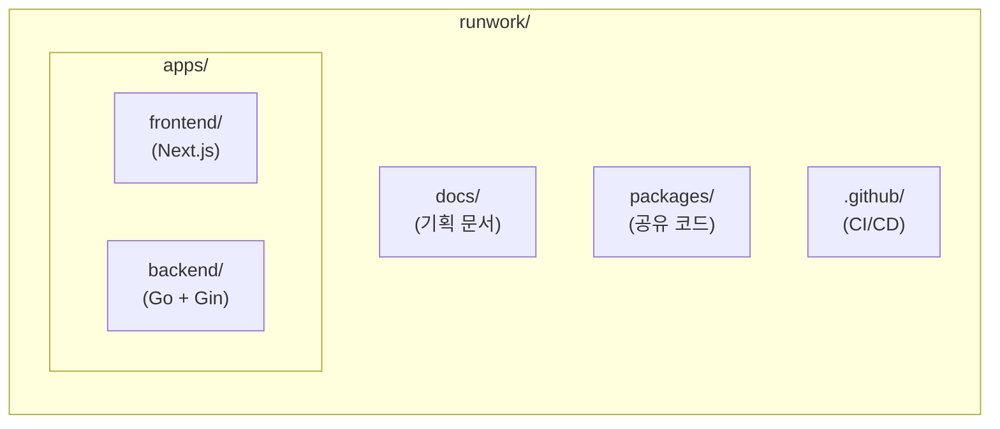
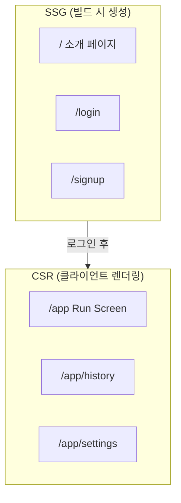
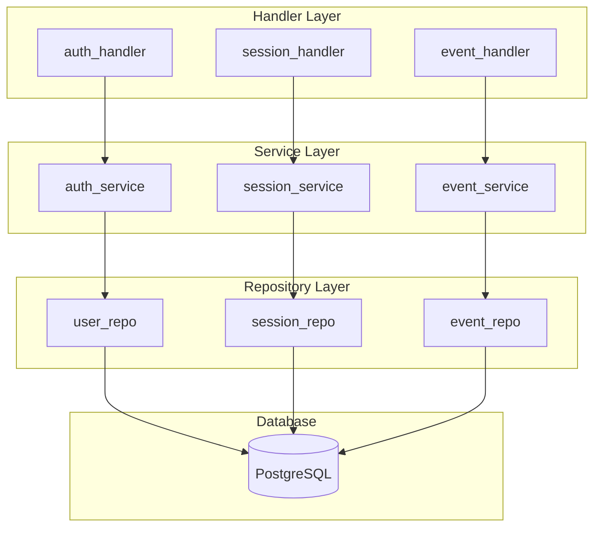

# Tech Stack & Infrastructure

## 1. 서비스 아키텍처



---

## 2. 인프라 상세

### 2.1 Vercel (Frontend Hosting)

| 항목 | 내용 |
|------|------|
| 플랜 | Hobby (무료) |
| 용도 | Next.js 호스팅, 정적/동적 페이지 |
| 대역폭 | 100GB/월 |
| 빌드 시간 | 6,000분/월 |
| 도메인 | 커스텀 도메인 지원 (무료 SSL) |

### 2.2 Fly.io (Backend Server)

| 항목 | 내용 |
|------|------|
| 플랜 | Free |
| 용도 | REST API 서버 |
| VM | 최대 3개 |
| 메모리 | 256MB RAM |
| 특징 | 상시 구동 (Cold Start 없음) |

### 2.3 Supabase (Database + Auth)

| 항목 | 내용 |
|------|------|
| 플랜 | Free |
| DB | PostgreSQL 500MB |
| Auth | 50,000 MAU |
| API | 무제한 요청 |
| Realtime | 200 동시 연결 |

---

## 3. 기술 스택

### 3.1 Frontend

| 카테고리 | 기술 | 버전 | 비고 |
|----------|------|------|------|
| Framework | Next.js | 14+ | App Router, SSR/SSG/CSR |
| Language | TypeScript | 5+ | |
| Styling | CSS Modules | | 컴포넌트별 스타일 격리 |
| Animation (UI) | Framer Motion | latest | 페이지 전환, 버튼 효과 |
| Animation (Game) | PixiJS | latest | Run Screen 캔버스 렌더링 |
| State | Zustand | latest | 가벼운 전역 상태 관리 |
| Data Fetching | TanStack Query | latest | API 캐싱, 자동 갱신 |
| Auth | Supabase JS | latest | 인증 연동 |
| Form | React Hook Form | latest | 폼 검증 |
| Date | date-fns | latest | 날짜/시간 처리 |

### 3.2 Backend

| 카테고리 | 기술 | 버전 | 비고 |
|----------|------|------|------|
| Language | Go | 1.21+ | |
| Framework | Gin | latest | HTTP 프레임워크 |
| ORM | GORM | latest | PostgreSQL 연동 |
| Migration | golang-migrate | latest | DB 스키마 버전 관리 |
| Container | Docker | | Fly.io 배포용 |

### 3.3 Database

| 카테고리 | 기술 | 비고 |
|----------|------|------|
| Primary DB | PostgreSQL | Supabase 제공 |
| Auth | Supabase Auth | Email + Google OAuth |

### 3.4 DevOps

| 카테고리 | 기술 | 비고 |
|----------|------|------|
| Frontend Deploy | Vercel | Git 연동 자동 배포 |
| Backend Deploy | Fly.io | Docker 기반 |
| Version Control | Git | GitHub |

---

## 4. 비용 구조

### 4.1 무료 플랜 한도

| 서비스 | 무료 한도 | 초과 시 |
|--------|----------|---------|
| Vercel | 100GB 대역폭/월 | $20/월 Pro |
| Fly.io | 3 VM, 256MB | 종량제 |
| Supabase | 500MB DB, 50K MAU | $25/월 Pro |

### 4.2 예상 비용 시나리오

| 단계 | 예상 사용자 | 월 비용 |
|------|------------|---------|
| MVP | ~1,000명 | $0 |
| 초기 성장 | ~10,000명 | $0 |
| 스케일업 | 50,000명+ | $50~100 |

---

## 5. 환경 구성

### 5.1 개발 환경



### 5.2 배포 환경



### 5.3 환경 변수

```bash
# Frontend (.env.local)
NEXT_PUBLIC_SUPABASE_URL=
NEXT_PUBLIC_SUPABASE_ANON_KEY=
NEXT_PUBLIC_API_URL=

# Backend (.env)
DATABASE_URL=
SUPABASE_SERVICE_ROLE_KEY=
```

---

## 6. API 통신 구조



---

## 7. 확장 계획

### 7.1 단기 (MVP)

- [x] 기본 아키텍처 확정
- [x] 기술 스택 확정
- [ ] 개발 환경 구성
- [ ] 기본 API 구현
- [ ] 프론트엔드 구현

### 7.2 중기 (서비스 안정화)

- [ ] 모니터링 추가 (Sentry, LogRocket 등)
- [ ] CI/CD 파이프라인 구축
- [ ] 테스트 자동화

### 7.3 장기 (스케일업)

- [ ] CDN 최적화
- [ ] 캐싱 전략 (Redis)
- [ ] 서버 리전 확장

---

## 8. 프로젝트 구조

### 8.1 Monorepo 구조



```text
runwork/
├── apps/
│   ├── frontend/           # Next.js (Vercel 배포)
│   │   ├── src/
│   │   ├── package.json
│   │   └── next.config.js
│   │
│   └── backend/            # Go + Gin (Fly.io 배포)
│       ├── cmd/
│       ├── internal/
│       ├── go.mod
│       ├── Dockerfile
│       └── fly.toml
│
├── docs/                   # 기획 문서
│
├── packages/               # 공유 코드 (필요시)
│   └── api-types/          # API 타입 정의
│
├── .github/
│   └── workflows/          # CI/CD
│
├── README.md
└── .gitignore
```

### 8.2 Frontend 폴더 구조

```text
apps/frontend/
├── src/
│   ├── app/                        # Next.js App Router
│   │   ├── layout.tsx              # 루트 레이아웃
│   │   ├── page.tsx                # 소개 페이지 (SSG)
│   │   ├── login/
│   │   │   └── page.tsx            # 로그인 (SSG)
│   │   ├── signup/
│   │   │   └── page.tsx            # 회원가입 (SSG)
│   │   └── app/
│   │       ├── layout.tsx          # 앱 레이아웃 (인증 체크)
│   │       ├── page.tsx            # Run Screen (CSR)
│   │       ├── history/
│   │       │   └── page.tsx        # History (CSR)
│   │       └── settings/
│   │           └── page.tsx        # Settings (CSR)
│   │
│   ├── components/
│   │   ├── common/                 # 공통 컴포넌트
│   │   │   ├── Button/
│   │   │   ├── Modal/
│   │   │   └── Input/
│   │   ├── landing/                # 소개 페이지 컴포넌트
│   │   ├── game/                   # PixiJS 게임 컴포넌트
│   │   │   ├── RunCanvas.tsx
│   │   │   ├── Character.tsx
│   │   │   └── Background.tsx
│   │   └── app/                    # 앱 전용 컴포넌트
│   │       ├── ActionButtons.tsx
│   │       ├── Timer.tsx
│   │       └── Timeline.tsx
│   │
│   ├── hooks/                      # 커스텀 훅
│   │   ├── useSession.ts
│   │   ├── useTimer.ts
│   │   └── useAuth.ts
│   │
│   ├── stores/                     # Zustand 스토어
│   │   ├── sessionStore.ts
│   │   └── userStore.ts
│   │
│   ├── lib/                        # 유틸리티
│   │   ├── api.ts                  # API 클라이언트
│   │   ├── supabase.ts             # Supabase 클라이언트
│   │   └── utils.ts
│   │
│   ├── styles/                     # 글로벌 스타일
│   │   ├── globals.css
│   │   └── variables.css           # CSS 변수 (컬러, 폰트)
│   │
│   └── types/                      # 타입 정의
│       ├── session.ts
│       ├── event.ts
│       └── user.ts
│
├── public/
│   ├── assets/                     # 정적 에셋
│   │   ├── characters/             # 캐릭터 스프라이트
│   │   ├── backgrounds/            # 배경 이미지
│   │   └── icons/
│   └── fonts/
│
├── package.json
├── next.config.js
├── tsconfig.json
└── .env.local
```

### 8.3 페이지별 렌더링 전략



| 페이지 | 경로 | 렌더링 | 이유 |
|--------|------|--------|------|
| 소개 페이지 | `/` | SSG | SEO, 빠른 첫 로딩 |
| 로그인 | `/login` | SSG | 정적 폼 |
| 회원가입 | `/signup` | SSG | 정적 폼 |
| Run Screen | `/app` | CSR | PixiJS, 실시간 상태 |
| History | `/app/history` | CSR | 유저 데이터 |
| Settings | `/app/settings` | CSR | 유저 데이터 |

### 8.4 Backend 폴더 구조

```text
apps/backend/
├── cmd/
│   └── server/
│       └── main.go              # 진입점
│
├── internal/
│   ├── config/
│   │   └── config.go            # 환경 변수, 설정
│   │
│   ├── models/
│   │   ├── user.go              # User 모델
│   │   ├── session.go           # Session 모델
│   │   └── event.go             # Event 모델
│   │
│   ├── repository/
│   │   ├── user_repo.go         # User DB 접근
│   │   ├── session_repo.go      # Session DB 접근
│   │   └── event_repo.go        # Event DB 접근
│   │
│   ├── service/
│   │   ├── auth_service.go      # 인증 로직
│   │   ├── session_service.go   # 세션 비즈니스 로직
│   │   └── event_service.go     # 이벤트 비즈니스 로직
│   │
│   ├── handler/
│   │   ├── auth_handler.go      # 인증 API 핸들러
│   │   ├── session_handler.go   # 세션 API 핸들러
│   │   └── event_handler.go     # 이벤트 API 핸들러
│   │
│   ├── middleware/
│   │   ├── auth.go              # JWT 검증
│   │   ├── cors.go              # CORS 설정
│   │   └── logger.go            # 요청 로깅
│   │
│   └── router/
│       └── router.go            # 라우트 정의
│
├── pkg/                         # 외부 공개 가능한 패키지
│   └── response/
│       └── response.go          # API 응답 포맷
│
├── migrations/                  # DB 마이그레이션 파일
│   ├── 000001_create_users.up.sql
│   ├── 000001_create_users.down.sql
│   ├── 000002_create_sessions.up.sql
│   └── ...
│
├── go.mod
├── go.sum
├── Dockerfile
├── fly.toml
└── .env.example
```

### 8.5 Backend 레이어 구조



| 레이어 | 역할 | 예시 |
|--------|------|------|
| **Handler** | HTTP 요청/응답 처리 | 파라미터 파싱, 응답 포맷팅 |
| **Service** | 비즈니스 로직 | 세션 상태 검증, 24시간 체크 |
| **Repository** | DB 접근 | GORM 쿼리, CRUD |

### 8.6 배포 설정

#### Dockerfile

`apps/backend/Dockerfile`

```dockerfile
# Build stage
FROM golang:1.21-alpine AS builder
WORKDIR /app
COPY go.mod go.sum ./
RUN go mod download
COPY . .
RUN go build -o main ./cmd/server

# Run stage
FROM alpine:latest
WORKDIR /app
COPY --from=builder /app/main .
EXPOSE 8080
CMD ["./main"]
```

#### fly.toml

`apps/backend/fly.toml`

```toml
app = "runwork-api"
primary_region = "nrt"

[build]

[http_service]
  internal_port = 8080
  force_https = true
  auto_stop_machines = false
  auto_start_machines = true

[env]
  PORT = "8080"
  GIN_MODE = "release"
```

#### 배포 명령어

```bash
# Backend 배포
cd apps/backend
fly deploy

# 환경 변수 설정
fly secrets set DATABASE_URL="postgresql://..."
fly secrets set SUPABASE_SERVICE_ROLE_KEY="..."
```

---

## 변경 이력

| 날짜 | 변경 내용 | 비고 |
|------|----------|------|
| 2024-12-13 | 초기 문서 작성 | 아키텍처 확정 |
| 2024-12-13 | Frontend 스택 확정 | Next.js, CSS Modules, PixiJS, Framer Motion |
| 2024-12-13 | Backend 스택 확정 | Go, Gin, GORM |
